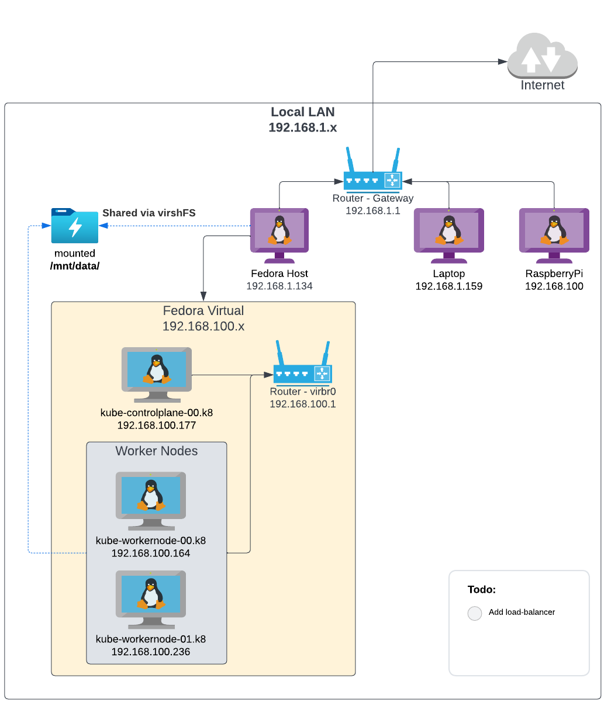

# Set up a set of Servers on there own sub-net 

following steps here : https://docs.fedoraproject.org/en-US/quick-docs/getting-started-with-virtualization/




## 
``` bash
Install dnf groupinfo virtualization

# Base install 
# sudo dnf install @virtualization
sudo dnf group install --with-optional virtualization

# Start the Virtualisation service
sudo systemctl start libvirtd

# To start the service on boot
sudo systemctl enable libvirtd
```

## Verify KVM is running
```bash
lsmod | grep kvm
kvm_amd               114688  0
kvm                   831488  1 kvm_amd
```

# Networking
From here: https://wiki.libvirt.org/page/Networking

use iptables DNAT rules to forward in specific ports, or you can set up a bridged environment.

Every standard libvirt installation provides NAT based connectivity to virtual machines out of the box. This is the so called 'default virtual network'. You can verify that it is available with
```bash
# virsh net-list --all
Name                 State      Autostart 
-----------------------------------------
default              active     yes
```

If it is missing, then the example XML config can be reloaded & activated

```bash
# virsh net-define /usr/share/libvirt/networks/default.xml
Network default defined from /usr/share/libvirt/networks/default.xml
# virsh net-autostart default
Network default marked as autostarted
# virsh net-start default
Network default started
```
```bash 
virsh net-define /usr/share/libvirt/networks/default.xml
virsh net-autostart default
Network default started
```


When the libvirt default network is running, you will see an isolated bridge device. This device explicitly does *NOT* have any physical interfaces added, since it uses NAT + forwarding to connect to outside world. Do not add interfaces
Ensure Auto Start

! NOTE: change this to a **Routed** network
```bash
brctl show
```

Some other applications may disable it, so the best option is to add the following to /etc/sysctl.conf
```bash
sudo vi /etc/sysctl.conf
#  net.ipv4.ip_forward = 1
```

# Creating virtual machines

Dowload the image for the Guest machine.

https://getfedora.org/en/server/download/

## Config VM

Verify Storage on partiions
```bash 
df -h
```
Verify Memory
```bash 
free -m
```
CPU
```bash
lscpu
```

## Storage
 libvirt default storage pool is located at `/var/lib/libvirt/images'

### Raw File (Sparse)
To create a dynamically allocated (sparse) raw file:
```bash
 sudo rm -f /var/lib/libvirt/images/guest.img
 sudo truncate --size=20480M /var/lib/libvirt/images/guest.img
```
###QCOW2
To create a new qcow2-formatted disk separately, you can use qemu-img (the example below specifies a disk size of 20G):
``` bash
  sudo qemu-img create -f qcow2 /var/lib/libvirt/images/guest-harbor.qcow2 20G
```
I'll use qcow for this image. 

result: 
```
Formatting '/var/lib/libvirt/images/guest-harbor.qcow2', fmt=qcow2 cluster_size=65536 extended_l2=off compression_type=zlib size=20480 lazy_refcounts=off refcount_bits=16
```

# Build VM Guest Image 
run the virt-install command using the following format (adjusting parameters as needed):
```
# sudo virt-install --name Habour --description 'Fedora 36 Server - Habour' --ram 4096 --vcpus 2 --disk path=/var/lib/libvirt/images/guest-harbor.qcow2 --os-variant fedora36 --network bridge=virbr0 --graphics vnc,listen=127.0.0.1,port=5901 --cdrom /var/lib/libvirt/images/Fedora-Server-dvd-x86_64-36-1.5.iso --noautoconsole
```

# virsh Networks

```bash
sudo virsh net-list --all


sudo nmcli connection show
ip addr show dev virbr0
ip addr sh

virsh domiflist k8-control-plane.local
 Interface   Type   Source   Model    MAC
---------------------------------------------------------
 -           user   -        virtio   52:54:00:32:81:03ow dev br0

brctl show virbr0


```

virsh edit k8-control-plane.local

```xml
    <interface type="network">
      <mac address="00:00:00:00:00:00"/>  # Give it some MAC address
      <source network="bridged-network"/>
      <model type="virtio"/>
      <address type="pci" domain="0x0000" bus="0x02" slot="0x00" function="0x0"/>  # bus 0x02 since it's 2nd
    </interface>
```

or Routed
```xml
<interface type="network">
  <mac address="52:54:00:27:16:b1"/>
  <source network="k8network" portid="29f5e1f4-e786-4f40-a88c-adce46838e74" bridge="virbr0"/>
  <target dev="vnet24"/>
  <model type="virtio"/>
  <alias name="net0"/>
  <address type="pci" domain="0x0000" bus="0x01" slot="0x00" function="0x0"/>
</interface>
```

FROM VM Console:

```xml
<network>
  <name>k8network</name>
  <uuid>5e4dfd68-69e7-47ed-87d1-3b25203d8b57</uuid>
  <forward mode="route"/>
  <bridge name="virbr0" stp="on" delay="0"/>
  <mac address="52:54:00:15:1f:a3"/>
  <domain name="k8network"/>
  <ip address="192.168.100.1" netmask="255.255.255.0">
    <dhcp>
      <range start="192.168.100.128" end="192.168.100.254"/>
    </dhcp>
  </ip>
</network>
```


```bash

https://linuxconfig.org/how-to-use-bridged-networking-with-libvirt-and-kvm

#virsh attach-interface --domain k8-control-plane.local --type bridge --source br0  --model virtio # --target vsrx-mgmt

virsh attach-interface --domain k8-control-plane.local --type bridge --source bridged-network --model virtio # --target vsrx-mgmt
#virsh attach-interface --domain k8-control-plane.local --type bridge --source br0 --model virtio --config --live 

# Start VM
virsh start k8-control-plane.local

# verify Interface List for damain 
virsh domiflist k8-control-plane.local

```

# Get the IP Address for VM

```bash 
virsh net-list
 Name              State    Autostart   Persistent
----------------------------------------------------
 bridged-network   active   yes         yes
```

