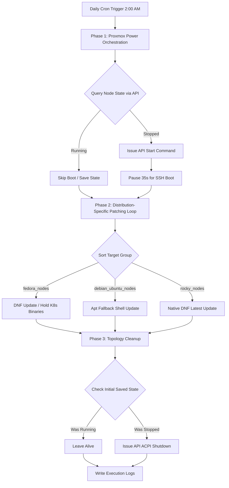

# Proxmox Cluster Automated Patching Guide
A comprehensive, step-by-step engineering manual for deploying automated, multi-distribution OS patching across a Proxmox hypervisor environment using Ansible.

---

## 1. System Architecture Overview

This automation engine operates on a three-phase lifecycle executed daily via a centralized Ansible controller container. It dynamically manages the power states of virtual machines (KVM) and containers (LXC), matches target operating systems to their native package managers, and restores the infrastructure topology to its original state.

### Infrastructure Lifecycle Workflow



---

## 2. Phase 1: Controller Container Environment Setup

Execute these steps inside your dedicated **Debian/Ubuntu Linux Container (LXC)** running on Proxmox to establish the required Ansible core architecture and Python API dependencies.

### Step 1: Install Core System Packages
Log in as your primary sudo user and install the foundational automation utilities:
```bash
sudo apt update && sudo apt upgrade -y
sudo apt install ansible jq python3-pip python3-venv git nano -y
```

### Step 2: Upgrade Python API Client Requirements
The Proxmox API integration requires a modern release of the `proxmoxer` library. Force an upgrade to version `2.3.0` or newer system-wide:
```bash
sudo pip3 install --break-system-packages --upgrade proxmoxer
```

### Step 3: Verify Software Requirements
Verify that your environmental toolchains are fully initialized:
```bash
ansible --version
python3 -c "import proxmoxer; print(proxmoxer.__version__)"
```
*(Ensure `proxmoxer` outputs a version string of `2.3.0` or higher).*

---

## 3. Phase 2: Target Node Service Account Deployment

Ansible connects securely to target servers using an isolated service account. Use this automated bash loop to distribute SSH keys and configure passwordless administrative access globally.

### Step 1: Create Workspace and Generate SSH Key
Log into the controller as your **`ansible`** service user:
```bash
mkdir -p ~/ansible-patching && cd ~/ansible-patching
ssh-keygen -t ed25519 -C "ansible-automation"
```
*(Press **Enter** through all configuration prompts to leave the passphrase blank).*

### Step 2: The Targets Initialisation Script (`accounts-on-targets.sh`)
Create a deployment script to read your network inventory configuration dynamically:
```bash
nano accounts-on-targets.sh
```

Paste the following shell script block inside:
```bash
#!/bin/bash

# Extract unique IP addresses directly from the hosts file configuration
TARGET_IPS=$(grep -E '^[0-9]' hosts | awk '{print $1}' | sort -u)

for ip in $TARGET_IPS; do
  if [ "$ip" == "localhost" ] || [ "$ip" == "127.0.0.1" ]; then
    continue
  fi

  echo "========================================="
  echo "=== Deploying Ansible User to: $ip ==="
  echo "========================================="

  # 1. Initialize the service user account (ignores errors if already created)
  ssh -o StrictHostKeyChecking=accept-new -t paul@$ip "sudo useradd -m -s /bin/bash ansible 2>/dev/null || true"

  # 2. Inject passwordless sudo elevations privilege parameters
  ssh -t paul@$ip "echo 'ansible ALL=(ALL) NOPASSWD:ALL' | sudo tee /etc/sudoers.d/ansible"

  # 3. Synchronize secure key configurations and set strict file system ownership permissions
  PUBKEY=$(cat ~/.ssh/id_ed25519.pub)
  ssh -t paul@$ip "sudo mkdir -p /home/ansible/.ssh && echo '$PUBKEY' | sudo tee -a /home/ansible/.ssh/authorized_keys && sudo chown -R ansible:ansible /home/ansible/.ssh && sudo chmod 700 /home/ansible/.ssh && sudo chmod 600 /home/ansible/.ssh/authorized_keys"
done
```
*Save and close (`Ctrl+O`, `Enter`, `Ctrl+X`), then mark it executable:*
```bash
chmod +x accounts-on-targets.sh
```

---

## 4. Phase 3: Configuration and Inventory Management

Create these foundational blueprint configurations inside your `~/ansible-patching/` project directory.

### File 1: Ansible Environmental Tweak (`ansible.cfg`)
```ini
[defaults]
interpreter_python = /usr/bin/python3
deprecation_warnings = False
```

### File 2: Proxmox API Secure Vault (`proxmox_vault.yml`)
```yaml
---
proxmox_api:
  node: "pve"
  host: "192.168.0.10"       # Replace with your primary Proxmox UI address
  user: "root@pam"
  password: "YourProxmoxRootPassword"  # Replace with your actual root password
```

### File 3: Network Topographic Inventory Map (`hosts`)
```ini
[fedora_nodes]
192.168.0.126 vmid=101
192.168.0.110 vmid=100

[debian_ubuntu_nodes]
192.168.0.101 vmid=106
192.168.0.116 vmid=108

[rocky_nodes]
192.168.0.139 vmid=102
192.168.0.113 vmid=104

[all_compute:children]
fedora_nodes
debian_ubuntu_nodes
rocky_nodes

[all_compute:vars]
ansible_user=ansible
ansible_shell_type=sh
```

---

## 5. Phase 4: Master Orchestration Playbook (`cluster_patch.yml`)

Create the master execution playbook containing the complete API power mapping, variable translation matrix, and update procedures:
```bash
nano cluster_patch.yml
```

Paste the following YAML block:
```yaml
---
# ==========================================
# PHASE 1: EVALUATE & BOOT STOPPED GUESTS
# ==========================================
- name: Proxmox Power State Orchestration
  hosts: all_compute
  gather_facts: false
  serial: 1
  vars_files:
    - proxmox_vault.yml

  tasks:
    - name: Query guest power state and boot if offline
      shell: |
        python3 -c "
        import requests, urllib3
        from proxmoxer import ProxmoxAPI
        urllib3.disable_warnings(urllib3.exceptions.InsecureRequestWarning)
        
        proxmox = ProxmoxAPI('{{ proxmox_api.host }}', user='{{ proxmox_api.user }}', password='{{ proxmox_api.password }}', verify_ssl=False)
        resources = proxmox.cluster.resources.get()
        match = next((r for r in resources if r.get('vmid') == {{ vmid }}), None)
        
        if match:
            print(f\"TYPE:{match['type']} STATE:{match['status']}\")
            if match['status'] == 'stopped':
                if match['type'] == 'qemu':
                    proxmox.nodes('{{ proxmox_api.node }}').qemu({{ vmid }}).status.start.post()
                elif match['type'] == 'lxc':
                    proxmox.nodes('{{ proxmox_api.node }}').lxc({{ vmid }}).status.start.post()
        "
      delegate_to: localhost
      register: pve_boot_check
      changed_when: "'STATE:stopped' in pve_boot_check.stdout"

    - name: Pause to allow operating systems to fully boot up
      pause:
        seconds: 35
      when: pve_boot_check.changed

# ==========================================
# PHASE 2: EXECUTE OS SPECIFIC PATCH LOOPS
# ==========================================
- name: Patch Fedora Node Infrastructure
  hosts: fedora_nodes
  become: true
  tasks:
    - name: Upgrade packages via DNF
      dnf:
        name: "*"
        state: latest
        exclude: [kubelet, kubeadm, kubectl]

- name: Patch Debian and Ubuntu System Infrastructure
  hosts: debian_ubuntu_nodes
  become: true
  tasks:
    - name: Upgrade packages via clean system shell (Apt Fallback)
      shell: "apt-get update && DEBIAN_FRONTEND=noninteractive apt-get dist-upgrade -y && apt-get autoremove -y"
      changed_when: true

- name: Patch Rocky Linux Infrastructure
  hosts: rocky_nodes
  become: true
  tasks:
    - name: Upgrade packages via DNF
      dnf:
        name: "*"
        state: latest

# ==========================================
# PHASE 3: RESTORE ORIGINAL POWER STATES
# ==========================================
- name: Restore Infrastructure States
  hosts: all_compute
  gather_facts: false
  vars_files:
    - proxmox_vault.yml

  tasks:
    - name: Return target guests to their original stopped state
      shell: |
        python3 -c "
        import requests, urllib3
        from proxmoxer import ProxmoxAPI
        urllib3.disable_warnings(urllib3.exceptions.InsecureRequestWarning)
        
        proxmox = ProxmoxAPI('{{ proxmox_api.host }}', user='{{ proxmox_api.user }}', password='{{ proxmox_api.password }}', verify_ssl=False)
        if 'TYPE:qemu' in '{{ hostvars[inventory_hostname]['pve_boot_check']['stdout'] }}':
            proxmox.nodes('{{ proxmox_api.node }}').qemu({{ vmid }}).status.stop.post()
        elif 'TYPE:lxc' in '{{ hostvars[inventory_hostname]['pve_boot_check']['stdout'] }}':
            proxmox.nodes('{{ proxmox_api.node }}').lxc({{ vmid }}).status.stop.post()
        "
      delegate_to: localhost
      when: hostvars[inventory_hostname]['pve_boot_check']['changed']
```

---

## 6. Verification and Deployment

Follow these sequential tasks to run your verification testing loops:

### Step 1: Run the Service Account Setup Loop
Run the user setup script to distribute your keys. Type your personal login password when prompted:
```bash
./accounts-on-targets.sh
```

### Step 2: Validate Inventory Parsing and Connectivity
Graph your internal mappings to ensure proper child-group definitions:
```bash
ansible-inventory -i hosts --graph
```
Next, run an ad-hoc ping test across all targets to verify SSH authentication:
```bash
ansible all -i hosts -m ping
```
*(Ensure all active machines return a green `"ping": "pong"` success block).*

### Step 3: Run the Live Production Playbook
```bash
ansible-playbook -i hosts cluster_patch.yml
```

---

## 7. Unattended Production Scheduling (Cron)

Configure the system scheduler to automatically run updates every night.

### Step 1: Initialize Cron Grid
Open the crontab editor for the `ansible` container user:
```bash
crontab -e
```

### Step 2: Apply the Schedule Entry
Scroll to the bottom of the file and paste this execution layout:
```text
0 2 * * * /usr/bin/ansible-playbook -i /home/ansible/ansible-patching/hosts /home/ansible/ansible-patching/cluster_patch.yml >> /home/ansible/ansible-patching/daily_patching.log 2>&1
```

### Verification Parameters
* **`0 2 * * *`**: Fires the script precisely at **2:00 AM every morning**, when network traffic is lowest.
* **`>> daily_patching.log 2>&1`**: Channels all terminal logging data and execution errors into a continuous file for auditing. Read the logs anytime with:
  ```bash
  cat /home/ansible/ansible-patching/daily_patching.log
  ```

---

## 8. Automated Log Management and Rotation (Production Maintenance)

Because this multi-phase orchestration playbook generates comprehensive terminal data for your entire compute network daily, leaving logs unchecked will eventually consume all storage space on your controller container. 

To prevent disk exhaustion, Linux uses a utility called **`logrotate`** to manage history limits, compress older entries, and automatically delete logs past a specific age threshold.

### Historical Log Rotation Lifecycle


### Step 1: Create the Logrotate Configuration Profile
Open a terminal shell on your `ansible-controller` and create a dedicated infrastructure service definition file using administrative privileges:
```bash
sudo nano /etc/logrotate.d/ansible-patching
```

### Step 2: Apply the Management Configuration Parameters
Paste the following production monitoring block inside the file:
```text
/home/ansible/ansible-patching/daily_patching.log {
    daily
    rotate 14
    compress
    delaycompress
    missingok
    notifempty
    copytruncate
}
```
*Save and exit (`Ctrl+O`, `Enter`, `Ctrl+X`).*

### Configuration Breakdown for Operators:
* **`daily`**: Forces the rotation engine to evaluate your patching log file every 24 hours.
* **`rotate 14`**: Retains exactly 14 legacy log records. On the 15th morning, the oldest record is automatically deleted.
* **`compress`**: Automatically gzips all legacy logs to reduce active storage consumption by up to 90%.
* **`delaycompress`**: Leaves the most recent rotation uncompressed (`.1`) so operators can troubleshoot yesterday's runs instantly without extraction tools.
* **`missingok`**: Prevents system error emails if the playbook hasn't generated a clean log file yet.
* **`notifempty`**: Skips the rotation check entirely if no updates ran and the log file size is 0 bytes.
* **`copytruncate`**: Copies the active log data to a backup file before clearing the primary log file down to 0 bytes, ensuring the background cron processes can continue writing without dropping text data.

### Step 3: Validate the Configuration
Run a manual log rotation test to verify that the parsing architecture reads your files without syntax errors:
```bash
sudo logrotate -d /etc/logrotate.d/ansible-patching
```
*(The `-d` dry-run flag tells the system to step through the rotation plan safely and output the calculations to your screen without actually changing or moving your current live files).*


