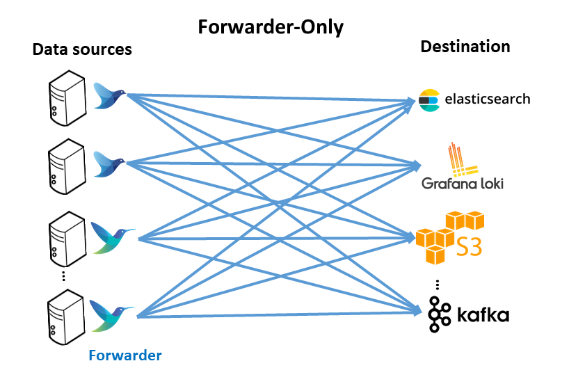
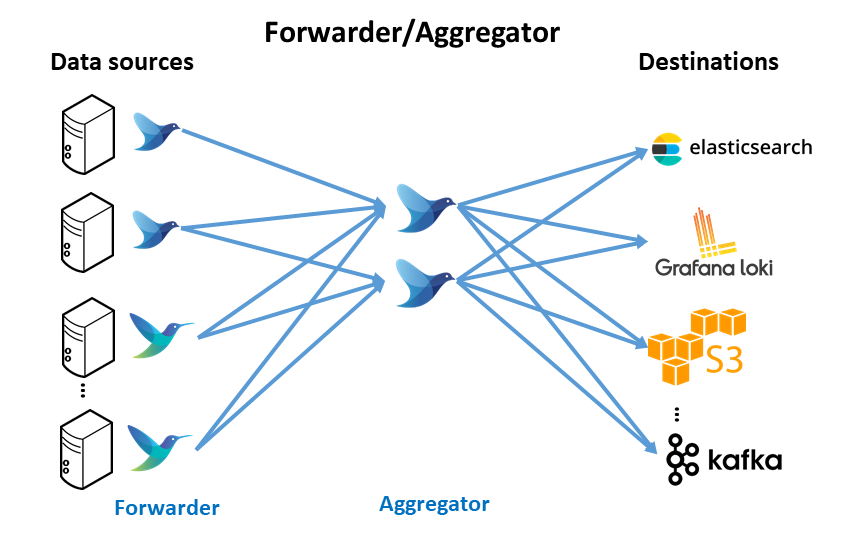

# FluentBit as a log collector and and an log Aggregaror.


## Log collection, aggregation and distribution architectures

Two different architectures can be implemented with Fluentbit and Fluentd
logging-forwarder-only 	logging-forwarder-aggregator
### Forwarder-only architecture

This pattern includes having a logging agent, based on fluentbit or fluentd, deployed on edge (forwarder), generally where data is created, such as Kubernetes nodes, virtual machines or baremetal servers. These forwarder agents collect, parse and filter logs from the edge nodes and send data direclty to a backend service.




#### Advantages

  1. No aggregator is needed; each agent handles backpressure.

#### Disadvantages

  1. Hard to change configuration across a fleet of agents (E.g., adding another backend or processing)
  1. Hard to add more end destinations if needed

### Forwarder/Aggregator Architecture

Similar to the forwarder-only deployment, lightweight logging agent instance is deployed on edge (forwarder) close to data sources (kubernetes nodes, virtual machines or baremetal servers). In this case, these forwarders do minimal processing and then use the forward protocol to send data to a much heavier instance of Fluentd or Fluent Bit (aggregator). This heavier instance may perform more filtering and processing before routing to the appropriate backend(s).



#### Advantages

  1. Less resource utilization on the edge devices (maximize throughput)
  1.  Allow processing to scale independently on the aggregator tier.
  1. Easy to add more backends (configuration change in aggregator vs. all forwarders).

#### Disadvantages

  1. Dedicated resources required for an aggregation instance.

With this architecture, in the aggregation layer, logs can be filtered and routed to different logs backends: Elastisearch and Loki. In the future different backend can be added to do further online processing. For example Kafka can be deployed as backend to build a Data Streaming Analytics architecture (Kafka, Apache Spark, Flink, etc) and route only the logs from a specfic application.


=====================================================
# Impementation

To send Fluent Bit logs from an edge device to a Fluent Bit aggregator, you need to configure Fluent Bit on the edge device to act as a forwarder and the aggregator to receive those forwarded logs. 
The process involves using the forward input plugin on the aggregator and configuring the output plugin on the edge device. 

## 1. Edge Device (Forwarder):

    Configure the Fluent Bit output plugin: The output plugin should be configured to send logs using the forward protocol to the aggregator's IP address and port. For example, the output plugin would look something like this in the fluent-bit.conf file: 

``` yaml
    [OUTPUT]
        Name          forward
        Match         *
        Host          aggregator_ip
        Port          24224
```

Replace aggregator_ip with the actual IP address of your Fluent Bit aggregator. 

Replace 24224 with the port number that the aggregator is listening on for forward protocol traffic. 
Start Fluent Bit: Ensure Fluent Bit is running on the edge device and configured correctly to send logs. 

## 2. Aggregator:

    Configure the Fluent Bit input plugin: The input plugin should be configured to receive forward messages. The forward input plugin should be specified in the fluent-bit.conf file, including the IP address and port the aggregator will listen on for incoming connections. For example: 

```yaml
    [INPUT]
        Name        forward
        Type        forward
        Bind        0.0.0.0
        Port        24224

```

The Bind option specifies the IP address the aggregator will listen on for connections (usually 0.0.0.0 for all interfaces). 

The Port option specifies the port the aggregator will listen on. 
Configure the output plugin: This plugin determines where the aggregated logs will be sent (e.g., Elasticsearch, Kafka, etc.). 
Start Fluent Bit: Ensure Fluent Bit is running on the aggregator and configured correctly to receive forwarded logs. 

## Explanation:

    Forward Protocol:
    The forward protocol is a lightweight protocol used to transmit log data between Fluent Bit instances. 

### Input/Output Plugins:
Fluent Bit uses input plugins to ingest data and output plugins to send it to other destinations. 
Configuration Files:
Both the edge device and aggregator will have their own fluent-bit.conf files, which define the configuration settings for Fluent Bit. 

Example Configuration:
Here's a more complete example to illustrate the setup:
Edge Device (fluent-bit.conf):
Code

```yaml
[INPUT]
    Name  tail
    Path  /var/log/application.log
    Tag  application

[OUTPUT]
    Name      forward
    Match     *
    Host      192.168.1.10
    Port      24224
```

Aggregator (fluent-bit.conf):
```yaml

[INPUT]
    Name        forward
    Type        forward
    Bind        0.0.0.0
    Port        24224

[OUTPUT]
    Name      elasticsearch
    Match     *
    Host      elasticsearch_ip
    Port      9200
    Database  fluentbit
    Index     application_logs
```

In this example: 

    The edge device collects logs from /var/log/application.log and forwards them to the aggregator's IP address (192.168.1.10) and port 24224.
    The aggregator receives the forwarded logs and sends them to an Elasticsearch instance. 

Key points:

    Ensure the edge device and aggregator have network connectivity to each other. 

Firewall rules may need to be configured to allow traffic on the specified ports. 
Debug Fluent Bit logs to troubleshoot any issues. 
