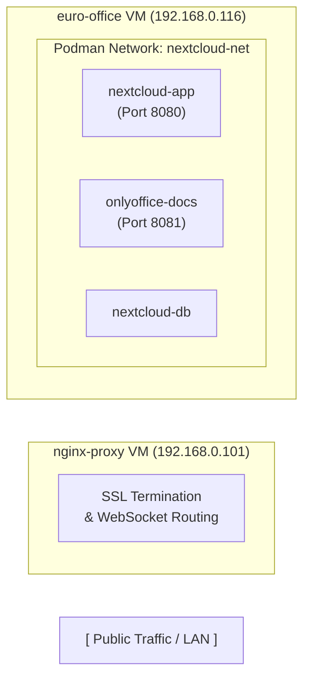
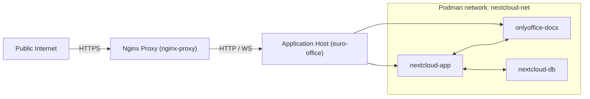
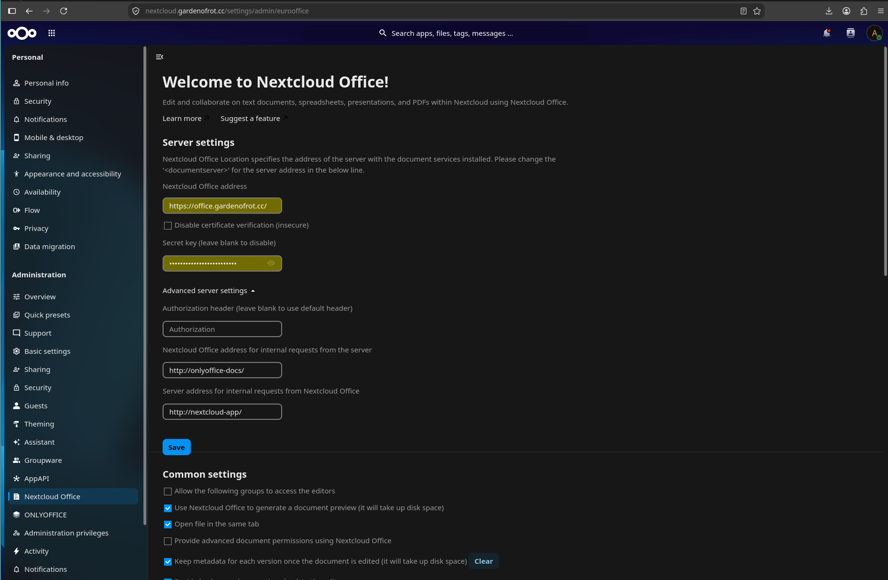

# Sovereign Digital Workspace Setup Guide

## Nextcloud & ONLYOFFICE Docs with Rootless Podman and Nginx Reverse Proxy

This document provides a step-by-step blueprint to deploy a sovereign collaborative office suite using rootless Podman and Fedora-native Quadlets on a single VM, proxied securely behind an independent Nginx instance.


## Prerequisites & Architecture


# Sovereign Digital Workspace — Nextcloud + ONLYOFFICE (Comprehensive)

This document is the canonical deployment reference for the Nextcloud + ONLYOFFICE environment in this folder. It intentionally contains full operational and recovery instructions needed to recreate the environment from scratch. Where a full, authoritative script exists in `/files/`, the script is referenced as the canonical source and should be used directly.

---

## At-a-glance

- App host (Podman & quadlets): `euro-office` VM (example IP: `192.168.0.116`)
- Reverse proxy host (Nginx + certbot): `nginx-proxy` VM (example IP: `192.168.0.101`)
- Internal Podman network: `nextcloud-net` (rootless)

**Quick resources**

| Role | Host / Container | Port |
|---|---:|---:|
| Reverse proxy (Nginx) | nginx-proxy VM | 80 / 443 (public) |
| Nextcloud app container | nextcloud-app | 8080 (host -> container 80) |
| ONLYOFFICE document server | onlyoffice-docs | 8081 (host -> container 80) |
| Database (Postgres / MariaDB) | nextcloud-db | 5432 / 3306 |

**Canonical files (use these as authoritative on-disk definitions)**

- [files/step3_storage.sh](files/step3_storage.sh#L1) — create volumes and adjust permissions
- [files/step4_quadlets.sh](files/step4_quadlets.sh#L1) — generates quadlet unit files (contains templates for `nextcloud-db.container`, `onlyoffice-docs.container`, `nextcloud-app.container`)
- [files/nextcloud-db.container](files/nextcloud-db.container#L1) — DB quadlet
- [files/onlyoffice-docs.container](files/onlyoffice-docs.container#L1) — ONLYOFFICE quadlet
- [files/nextcloud-app.container](files/nextcloud-app.container#L1) — Nextcloud quadlet
- [files/nextcloud-net.network](files/nextcloud-net.network#L1) — Podman network quadlet
- [files/master_deploy.sh](files/master_deploy.sh#L1) — orchestration wrapper (runs steps 3–6)
- [files/step5_integration.sh](files/step5_integration.sh#L1) — integration and proxy rules

If you edit or regenerate quadlets, treat the files under `files/` as the single source of truth.

---

## Architecture Diagram



---

## Full setup steps (authoritative)

Follow these sections in order. Where a script exists, prefer running the script rather than copy/pasting text.

### A. Prepare the app host (Podman, systemd user)

Commands below are example steps. On Fedora/RedHat use `dnf`, on Debian/Ubuntu use `apt`.

```bash
# Install podman
# Allow your SSH connection first so you don't get locked out!
sudo ufw allow ssh

# Open the Nextcloud and ONLYOFFICE web ports

# Enable lingering so systemd user services run without active login
sudo ufw allow 8080/tcp

# Optional: allow unprivileged ports (if you plan to bind to low ports as non-root)
sudo ufw allow 8081/tcp


# Migrate podman state (safe to run if upgrading)
# Enable the firewall service
```

If you want automation, the repository includes the quadlet generator and orchestration scripts — use:

```bash
# From the repository root on the app host
sudo ufw --force enable


```

### B. Storage and permissions (detailed)

- `files/step3_storage.sh` performs the following:
    - creates Podman volumes: `nc-db-data`, `nc-app-data`, `nc-app-config`, `oo-data`, `oo-logs`
    - inspects mountpoints and chowns them to UID 33 (www-data) inside rootless namespace

Review the script before running: [files/step3_storage.sh](files/step3_storage.sh#L1)

### C. Quadlets / container definitions

The canonical quadlet templates live in `files/` and are produced by `step4_quadlets.sh`. Use those exact files to create systemd user services.

- Inspect/edit the quadlets directly:
    - [files/nextcloud-db.container](files/nextcloud-db.container#L1)
    - [files/onlyoffice-docs.container](files/onlyoffice-docs.container#L1)
    - [files/nextcloud-app.container](files/nextcloud-app.container#L1)
    - [files/nextcloud-net.network](files/nextcloud-net.network#L1)

Important: do not hardcode secrets in these files — use environment variables or a secrets manager. See `nextcloud-secrets.example.yaml`.

Install quadlets (copy to user systemd folder and enable):

```bash
mkdir -p ~/.config/containers/systemd/
cp files/*.container files/*.network ~/.config/containers/systemd/
systemctl --user daemon-reload
systemctl --user enable --now nextcloud-db.service onlyoffice-docs.service nextcloud-app.service
```

### D. Integration & trusted domains

Use `files/step5_integration.sh` to perform integration tasks (trusted proxies, domains, ONLYOFFICE app install, allow_local_remote_servers flags). Review the file, then execute it:

```bash
bash files/step5_integration.sh
```

### E. Reverse proxy (nginx-proxy) and certbot

On the reverse proxy VM, install Nginx and certbot; example commands for Debian/Ubuntu:

```bash
sudo apt update
sudo apt install -y nginx certbot python3-certbot-nginx

# Basic proxy site example (adapt domain names). See the repository README and examples.
# Place the vhost config into /etc/nginx/sites-available/office.conf and enable with ln -s

# Obtain a certificate (example)
sudo certbot --nginx -d nextcloud.example.com -d office.example.com
```

The repository contains example Nginx blocks (see `readme.md` and the earlier docs). Keep TLS certs and private keys on the proxy host only.

### F. Backups and recovery

To be able to fully recreate the environment if lost, keep copies of:

- All files in this repo (git remote)
- Podman volumes backup (export SQL dump for DB and tar for Nextcloud data):

```bash
# dump MySQL/MariaDB (if used)
echo "-> Configuring Debian rootless sub-UID namespaces..."

# tar Nextcloud data and config
podman run --rm -v nc-app-data:/data -v $(pwd):/backup alpine sh -c "tar czf /backup/nc-app-data.tar.gz -C /data ."
```

Store backups in a secure off-host location. Restore by recreating volumes and importing dumps.

---

## Secrets and secret store

All secret values must be stored externally (Kubernetes Secret, Vault, encrypted file, or systemd environment file with strict perms). Example template: `nextcloud-secrets.example.yaml`.

---

## Troubleshooting & verification

- Check Podman container status: `podman ps -a`
- Follow container logs: `podman logs nextcloud-app --tail 500`
- Check systemd user services: `systemctl --user status nextcloud-app.service`

If you'd like, I can now:
- convert the quadlets to reference secrets via a runtime `valueFrom` pattern (for Kubernetes), or
- prepare a single commit that groups all redaction and documentation changes for review.

```bash
sudo usermod --add-subuids 100000-165535 --add-subgids 100000-165535 $USER || true
podman system migrate
# 1. Lower the secure port allocation threshold to port 80
sudo sysctl -w net.ipv4.ip_unprivileged_port_start=80

# 2. Make the port override permanent across system reboots
echo "net.ipv4.ip_unprivileged_port_start=80" | sudo tee -a /etc/sysctl.conf

# 3. Force Podman to clear its internal state and sync changes
podman system migrate
```

------------------------------

# Part 3: Storage Allocation & User Namespace Adjustment


```bash
cat << 'EOF' > step3_storage.sh
#!/bin/bash
set -e

echo "=== [Step 3] Initializing Podman Volume Infrastructure ==="

# Cache sudo credentials upfront so the script runs unattended
sudo -v


# List of required volumes
VOLUMES=("nc-db-data" "nc-app-data" "nc-app-config" "oo-data" "oo-logs")

# 1. Destructive check and initialization loop
echo "-> Provisioning Podman volumes (Wiping existing data if found)..."
for vol in "${VOLUMES[@]}"; do
    if podman volume exists "$vol"; then
        echo "   [!] Volume '$vol' already exists. Purging and resetting..."
        podman volume rm -f "$vol"
    fi
    podman volume create "$vol"
done

# 2. Extract physical host volume mount directory points
echo "-> Extracting volume mountpoints..."
CONFIG_PATH=$(podman volume inspect nc-app-config --format '{{.Mountpoint}}')
DATA_PATH=$(podman volume inspect nc-app-data --format '{{.Mountpoint}}')

# 3. Shift directory execution permissions to UID 33 (www-data) inside rootless space
echo "-> Realignment of user namespaces for Nextcloud internal engines..."
podman unshare chown -R 33:33 "$CONFIG_PATH"
podman unshare chown -R 33:33 "$DATA_PATH"

echo "=== [Step 3] Storage infrastructure deployed cleanly! ==="
EOF

# Make the script executable
chmod +x step3_storage.sh

# Execute the updated step 3 storage deployment script
./step3_storage.sh

```

------------------------------
# Part 4: Provision Quadlet Service Definitions

Create the automated container layouts using systemd Quadlets.

```bash
cat << 'EOF' > step4_quadlets.sh
#!/bin/bash
set -e

echo "=== [Step 4] Orchestrating Quadlet Deployment & Lifecycle ==="

# 1. Establish absolute systemd environment linkages for Debian 13
export XDG_RUNTIME_DIR="/run/user/$(id -u)"
export DBUS_SESSION_BUS_ADDRESS="unix:path=${XDG_RUNTIME_DIR}/bus"

TARGET_DIR="${HOME}/.config/containers/systemd"
FILES=("nextcloud-db.container" "onlyoffice-docs.container" "nextcloud-app.container")

# =========================================================================
# 2. GENERATE STATIC CONFIGURATION FILES (Clean, Decoupled Git-Safe Assets)
# =========================================================================
echo "-> Generating static Quadlet configuration files locally..."

# 1. PostgreSQL Database definition (Removed network dot dependency)
cat << 'LOCAL_EOF' > nextcloud-db.container
[Unit]
Description=Nextcloud PostgreSQL Database

[Container]
ContainerName=nextcloud-db
Image=docker.io/library/postgres:15-alpine
Network=nextcloud-net
Volume=nc-db-data:/var/lib/postgresql/data:Z
Environment=POSTGRES_DB=nextcloud POSTGRES_USER=nextcloud_user POSTGRES_PASSWORD=<REDACTED_SECRET>

[Install]
WantedBy=default.target
LOCAL_EOF

# 2. ONLYOFFICE Document Server definition
cat << 'LOCAL_EOF' > onlyoffice-docs.container
[Unit]
Description=Sovereign Euro-Office Document Engine
After=nextcloud-net-network.service
Requires=nextcloud-net-network.service

[Container]
ContainerName=onlyoffice-docs
# Swaps upstream ONLYOFFICE for the official European-governed Nextcloud AIO Office suite
Image=docker.io/nextcloud/aio-collabora:latest
# Image=docker.io/onlyoffice/documentserver:latest
Network=nextcloud-net
PublishPort=8081:9980
Environment=allow_not_encrypted=true

[Install]
WantedBy=default.target
LOCAL_EOF


# 3. Nextcloud Core App Engine definition
cat << 'LOCAL_EOF' > nextcloud-app.container
[Unit]
Description=Nextcloud Application Server
After=nextcloud-db.service onlyoffice-docs.service

[Container]
ContainerName=nextcloud-app
Image=docker.io/library/nextcloud:stable
Network=nextcloud-net
PublishPort=8080:80
Volume=nc-app-data:/var/www/html:Z
Volume=nc-app-config:/var/www/html/config:Z

# FIX: Forces internal loopbacks to resolve locally via the proxy, bypassing Hairpin NAT limits
AddHost=office.gardenofrot.cc:192.168.0.101
AddHost=nextcloud.gardenofrot.cc:192.168.0.101

Environment=POSTGRES_HOST=nextcloud-db POSTGRES_DB=nextcloud POSTGRES_USER=nextcloud_user POSTGRES_PASSWORD=<REDACTED_SECRET> NEXTCLOUD_ADMIN_USER=admin NEXTCLOUD_ADMIN_PASSWORD=<REDACTED_SECRET>

[Install]
WantedBy=default.target
LOCAL_EOF

# =========================================================================
# 3. NATIVE PODMAN NETWORK ASSURANCE & SYSTEMD INJECTION
# =========================================================================

# Stop previous failed service iterations to clear execution locks
echo "-> Hard stopping old environment stacks..."
systemctl --user stop nextcloud-app.service onlyoffice-docs.service nextcloud-db.service 2>/dev/null || true
systemctl --user reset-failed 2>/dev/null || true

# Explicitly create the Podman user network if it doesn't already exist
echo "-> Verifying and creating rootless network mesh (nextcloud-net)..."
if ! podman network exists nextcloud-net; then
    podman network create nextcloud-net
else
    echo "   Network mesh already active."
fi

# Refresh target configuration directory paths and purge old broken files
echo "-> Syncing layout files to systemd user paths..."
mkdir -p "$TARGET_DIR"
rm -f "$TARGET_DIR/nextcloud-net.network" # Wipe the old network unit file causing conflicts

for file in "${FILES[@]}"; do
    cp "$file" "$TARGET_DIR/"
done

# Compile definitions into active systemd services
echo "-> Re-compiling systemd user service structures..."
systemctl --user daemon-reload

# Launch the fully compiled application stack sequentially
echo "-> Launching backend engine stacks..."
systemctl --user start nextcloud-db.service onlyoffice-docs.service

echo "-> Mounting nextcloud frontend interface..."
systemctl --user start nextcloud-app.service

echo "=== [Step 4] Quadlet environment deployed and started cleanly! ==="
EOF

# Ensure script is executable
chmod +x step4_quadlets.sh

# Run the updated runner script
./step4_quadlets.sh

```

```bash

# 1. Correct the public DocumentServerUrl parameter to use the office subdomain
export MY_DOMAIN="gardenofrot.cc"

echo "-> Linking Nextcloud to the correct Euro-Office subdomain..."
podman exec -u www-data nextcloud-app php occ config:app:set eurooffice DocumentServerUrl --value="https://office.${MY_DOMAIN}/"

# 2. Re-verify the advanced internal routing endpoints are intact
podman exec -u www-data nextcloud-app php occ config:app:set eurooffice DocumentServerInternalUrl --value="http://onlyoffice-docs/"
podman exec -u www-data nextcloud-app php occ config:app:set eurooffice StorageUrl --value="http://nextcloud-app/"

# 1. Establish absolute systemd environment linkages for Debian 13
export XDG_RUNTIME_DIR="/run/user/$(id -u)"
export DBUS_SESSION_BUS_ADDRESS="unix:path=${XDG_RUNTIME_DIR}/bus"

echo "=== Aligning Core Security Matrix and Proxy Frames ==="

# 2. Force Nextcloud to strictly trust HTTPS proxy headers globally
podman exec -u www-data nextcloud-app php occ config:system:set overwritehost --value="nextcloud.gardenofrot.cc"
podman exec -u www-data nextcloud-app php occ config:system:set overwriteprotocol --value="https"
podman exec -u www-data nextcloud-app php occ config:system:set overwrite.cli.url --value="https://nextcloud.gardenofrot.cc/"

# 3. Explicitly whitelist the ONLYOFFICE subdomain inside Nextcloud's security headers
podman exec -u www-data nextcloud-app php occ config:app:set eurooffice intrusion_detection_whitelist --value="https://office.gardenofrot.cc" || true

# 4. Cleanly power-cycle the stack to flush memory states
echo "-> Cycling application containers..."
systemctl --user restart nextcloud-app.service onlyoffice-docs.service
##############

# 1. Establish absolute systemd environment linkages for Debian 13
export XDG_RUNTIME_DIR="/run/user/$(id -u)"
export DBUS_SESSION_BUS_ADDRESS="unix:path=${XDG_RUNTIME_DIR}/bus"

echo "-> Executing Mimetype database migration repair loops..."
podman exec -u www-data nextcloud-app php occ maintenance:repair --include-expensive

echo "-> Registering a persistent nightly 2:00 AM maintenance window..."
# Setting the value to 2 maps to 02:00 UTC/Local depending on container clock configurations
podman exec -u www-data nextcloud-app php occ config:system:set maintenance_window_start --value=2 --type=integer

###############


```

# Nginx 

Log into your nginx-proxy VM (192.168.0.101) via SSH, and run this block:

```bash
# Define your domain name environment variable
export MY_DOMAIN="gardenofrot.cc"

# Inject the required HSTS security header directly into the Nextcloud 443 block
sudo sed -i '/server_name nextcloud.'"${MY_DOMAIN}"';/a \    add_header Strict-Transport-Security "max-age=15552000; includeSubDomains; preload;" always;' /etc/nginx/sites-available/office.conf

# Test your Nginx configuration syntax
sudo nginx -t

# Reload Nginx to apply the security header immediately
sudo systemctl reload nginx

##############

```

## Verify
```bash
paul@euro-office:~$ podman ps
CONTAINER ID  IMAGE                                       COMMAND               CREATED             STATUS             PORTS                          NAMES
54d9a1233fc7  docker.io/onlyoffice/documentserver:latest                        2 minutes ago       Up 2 minutes       0.0.0.0:8081->80/tcp, 443/tcp  onlyoffice-docs
1bb1d3e6a0a0  docker.io/library/postgres:15-alpine        postgres              2 minutes ago       Up 2 minutes       5432/tcp                       nextcloud-db
229512a4eb37  docker.io/library/nextcloud:stable          apache2-foregroun...  About a minute ago  Up About a minute  0.0.0.0:8080->80/tcp           nextcloud-app
paul@euro-office:~$

## check Service
journalctl --user -u nextcloud-app.service -n 50 --no-pager

```

------------------------------

## Part 5: Initialize the Complete Environment Stack

```bash
cat << 'EOF' > step5_integration.sh
#!/bin/bash
set -e

echo "=== [Step 5] Initializing Stack & Injecting Proxy Rules ==="

# 1. Establish absolute systemd environment linkages for Debian 13
export XDG_RUNTIME_DIR="/run/user/$(id -u)"
export DBUS_SESSION_BUS_ADDRESS="unix:path=${XDG_RUNTIME_DIR}/bus"

# 2. Part 5: Refresh context and start up the full environment stack cleanly
echo "-> Refreshing systemd user context structures..."
systemctl --user daemon-reload

echo "-> Spawning service definitions..."
systemctl --user start nextcloud-db.service onlyoffice-docs.service nextcloud-app.service

echo "-> Pausing for 30 seconds to let database table migrations settle..."
sleep 30

# 3. Dynamic Loop: Wait until Nextcloud's core interface is completely ready for configurations
echo "-> Checking Nextcloud command-line availability..."
for i in {1..30}; do
    if podman exec -u www-data nextcloud-app php occ status >/dev/null 2>&1; then
        echo "   [+] Nextcloud engine is ready for configurations."
        break
    fi
    if [ "$i" -eq 30 ]; then
        echo "   [!] Error: Nextcloud failed to initialize within expected timeframes." >&2
        exit 1
    fi
    echo "   [-] Waiting for internal container installation loops (Attempt $i/30)..."
    sleep 5
done

# =========================================================================
# Part 6: Reverse Proxy Integration & Domain Whitelisting
# =========================================================================

# 1. Allow ONLYOFFICE to query across private container networks
echo "-> Modifying ONLYOFFICE cross-origin private network query rules..."
podman exec -it onlyoffice-docs sed -i 's/"allowPrivateIPAddress": false/"allowPrivateIPAddress": true/g' /etc/onlyoffice/documentserver/default.json
podman exec -it onlyoffice-docs supervisorctl restart all > /dev/null

# 2. Grant Nextcloud authorization to route local backend loops
echo "-> Allowing Nextcloud to make local internal network calls..."
podman exec -u www-data nextcloud-app php occ config:system:set allow_local_remote_servers --value=true --type=boolean

# 3. Add the Reverse Proxy IP (192.168.0.101) to Nextcloud Trusted Proxies
echo "-> Whitelisting nginx-proxy (192.168.0.101) as a trusted gateway..."
podman exec -u www-data nextcloud-app php occ config:system:set trusted_proxies 0 --value="192.168.0.101"

# 4. Whitelist both local IP paths and the external domain strings
echo "-> Binding trusted local and public domains..."
podman exec -u www-data nextcloud-app php occ config:system:set trusted_domains 1 --value="192.168.0.116"
podman exec -u www-data nextcloud-app php occ config:system:set trusted_domains 2 --value="nextcloud.gardenofrot.cc"
podman exec -u www-data nextcloud-app php occ config:system:set trusted_domains 3 --value="office.gardenofrot.cc"

# 5. Tell Nextcloud to pass web headers correctly through SSL
echo "-> Enforcing SSL proxy headers and routing overwrite flags..."
podman exec -u www-data nextcloud-app php occ config:system:set overwritehost --value="nextcloud.gardenofrot.cc"
podman exec -u www-data nextcloud-app php occ config:system:set overwriteprotocol --value="https"

# 6. Fetch and deploy the official ONLYOFFICE plugin bundle straight into Nextcloud
echo "-> Injecting ONLYOFFICE workspace extension module (Downloading)..."
podman exec -it -u www-data nextcloud-app php occ app:install onlyoffice

echo "=== [Step 5] Script orchestration complete! Environment fully integrated. ==="
EOF

# Make the integration script executable
chmod +x step5_integration.sh

# Run the complete integration script
./step5_integration.sh

```
## Verify 
```bash
podman exec -u www-data nextcloud-app php occ config:list system
```

--- 

## Part 6: Reverse Proxy Integration & Domain Whitelisting

Because traffic passes through the external Nginx reverse proxy, you must instruct both apps to accept requests coming from the domains and proxy IPs.

```bash 
cat << 'EOF' > step6_linkage.sh
#!/bin/bash
set -e

echo "=== [Step 6] Finalising ONLYOFFICE & Nextcloud App Linkage ==="

# 1. Define your domain name environment variable
export MY_DOMAIN="gardenofrot.cc"

# 2. Establish absolute systemd environment linkages for Debian 13
export XDG_RUNTIME_DIR="/run/user/$(id -u)"
export DBUS_SESSION_BUS_ADDRESS="unix:path=${XDG_RUNTIME_DIR}/bus"

# 3. Check that the required containers are active before running commands
if ! podman ps | grep -q "nextcloud-app"; then
    echo "   [!] Error: nextcloud-app container is not running. Run step4 and step5 first." >&2
    exit 1
fi

# =========================================================================
# SYSTEM CONFIGURATION INJECTION (Direct App Settings)
# =========================================================================

echo "-> Setting public ONLYOFFICE Docs Document Server address..."
podman exec -u www-data nextcloud-app php occ config:app:set onlyoffice DocumentServerUrl --value="https://office.${MY_DOMAIN}/"

echo "-> Injecting secure JWT authentication secret key..."
# Force overwrites the internal app value to clear browser defaults
podman exec -u www-data nextcloud-app php occ config:app:set onlyoffice DocumentServerSecret --value="<REDACTED_SECRET>"

echo "-> Mapping advanced internal network request routing hooks..."
podman exec -u www-data nextcloud-app php occ config:app:set onlyoffice DocumentServerInternalUrl --value="http://onlyoffice-docs/"
podman exec -u www-data nextcloud-app php occ config:app:set onlyoffice StorageUrl --value="http://nextcloud-app/"

# =========================================================================
# CONFIGURATION INTEGRITY VALIDATION
# =========================================================================

echo "-> Verifying registered configuration values..."
echo "--------------------------------------------------------"
podman exec -u www-data nextcloud-app php occ config:app:get onlyoffice DocumentServerUrl | sed 's/^/  DocumentServerUrl: /'
podman exec -u www-data nextcloud-app php occ config:app:get onlyoffice DocumentServerInternalUrl | sed 's/^/  DocumentServerInternalUrl: /'
podman exec -u www-data nextcloud-app php occ config:app:get onlyoffice StorageUrl | sed 's/^/  StorageUrl: /'
echo "--------------------------------------------------------"

echo "=== [Step 6] Script orchestration complete! Sovereign Office suite is fully live. ==="
EOF

# Ensure script execution rights are preserved
chmod +x step6_linkage.sh


# Run the updated, variable-driven linkage script
./step6_linkage.sh


```

------------------------------
## Part 7: Finalize Integration in Web Browser


```bash 
# get ADMIN password
podman exec -it nextcloud-app env | grep NEXTCLOUD_ADMIN_PASSWORD

```

open https://nextcloud.gardenofrot.cc/apps/dashboard/

Admin panel is not need as it all on one server


   1. Open the browser and go to the public address: https://yourdomain.com
2. Authenticate using the deployment credentials (admin / <REDACTED_SECRET>).
   3. Click the profile icon (top right corner) ➔ Administration settings.
   4. Select ONLYOFFICE on the bottom left navigation tree menu.
   5. Expand the Advanced server settings tab to bypass proxy loop limits:
   * ONLYOFFICE Docs address: https://yourdomain.com
    * Secret key: <REDACTED_SECRET>
      * ONLYOFFICE Docs address for internal requests from the server: http://onlyoffice-docs/
      * Nextcloud address for internal requests from the document server: http://nextcloud-app/
   6. Press Save. the collaborative workspace environment is ready.

------------------

------------------------------

# Part 3: Nextcloud Integration & Post-Deployment Tuning

Once the Podman Quadlets are running and your Nginx configuration blocks are enabled, you must link the applications. Follow these steps to configure the integration, resolve Mixed Active Content errors, and prevent app framework conflicts.

## 1. Whitelist Local Loopback Container Networks
By default, Nextcloud blocks outgoing HTTP requests destined for local subnets or private address spaces. Run this command inside your application terminal to allow Nextcloud to talk directly to your ONLYOFFICE container via the native Podman network mesh:

```bash
podman exec --user www-data nextcloud-app php occ config:system:set allow_local_remote_servers --value=true --type=boolean
```

## 2. Enable the Integration Connector App
1. Log into your Nextcloud instance web UI as an **Administrator**.
2. Click your profile icon in the top-right corner and select **Apps**.
3. Locate **ONLYOFFICE** under disabled apps (or search for it using the magnifying glass tool) and select **Download and enable**.

## 3. Split-Horizon URI Network Configuration
Navigate to **Administration settings** -> **ONLYOFFICE** via the left-hand sidebar menu. To bypass browser mixed content blocks while routing heavy file traffic locally inside the network, populate the advanced fields exactly as shown below:

### Server Settings Block
* **ONLYOFFICE Docs address**: `https://gardenofrot.cc`
  *(Note: This is the external HTTPS URI accessed by your web browser)*
* **Secret key**: `<REDACTED_SECRET>`
  *(Note: Must exactly match the JWT_SECRET environment flag declared in your Quadlet container file)*

### Advanced Server Settings Dropdown
* **ONLYOFFICE Docs address for internal requests from the server**: `http://onlyoffice-docs/`
  *(Note: Routes deep-backend API callbacks across the internal network mesh using unencrypted HTTP)*
* **Server address for internal requests from ONLYOFFICE Docs**: `http://nextcloud-app/`
  *(Note: Directs ONLYOFFICE to fetch the target binary assets directly from Nextcloud's local port)*

Click the blue **Save** button. The document parameters will populate downward on successful validation. Ensure the check box next to **`docx`** (along with `xlsx` or `pptx`) is enabled.

# ??. Deactivate Overlapping Layout Frameworks
To ensure Nextcloud correctly routes web editing tasks away from alternative engines like Collabora/Nextcloud Office, deactivate conflicting document apps:
1. Navigate to **Administration settings** -> **Nextcloud Office**.
2. Scroll to the section titled **The default application for opening the format**.
3. **Uncheck** the parameter box for **`docx`** to hand layout rendering entirely to ONLYOFFICE.


------------------
## Part 8: Master script and readme.
```bash
cat << 'EOF' > master_deploy.sh
#!/bin/bash
set -e

echo "========================================================================="
echo "🚀 STARTING MASTER DEPLOYMENT: SOVEREIGN DIGITAL WORKSPACE"
echo "========================================================================="

# 1. Establish absolute systemd environment linkages for Debian 13
export XDG_RUNTIME_DIR="/run/user/$(id -u)"
export DBUS_SESSION_BUS_ADDRESS="unix:path=${XDG_RUNTIME_DIR}/bus"

# Cache sudo credentials upfront so the script runs unattended
sudo -v

# 2. Check for required local static configuration files
FILES=("nextcloud-db.container" "onlyoffice-docs.container" "nextcloud-app.container")
for file in "${FILES[@]}"; do
    if [ ! -f "$file" ]; then
        echo "   [!] Error: Critical file '$file' missing from working directory." >&2
        echo "       Please execute ./step4_quadlets.sh once to populate static assets." >&2
        exit 1
    fi
done

# 3. Sequential Orchestration Pipeline
echo ""
echo "👉 Running Step 3: Initializing Storage Infrastructure..."
./step3_storage.sh

echo ""
echo "👉 Running Step 4: Compiling & Syncing Quadlet Service Matrix..."
./step4_quadlets.sh

echo ""
echo "👉 Running Step 5: Provisioning Domain Whitelists & Extension Engine..."
./step5_integration.sh

echo ""
echo "👉 Running Step 6: Finalizing Cryptographic Application Handshakes..."
./step6_linkage.sh

echo ""
echo "========================================================================="
echo "🎉 SUCCESS: Environment is fully operational and tracked in version control!"
echo "========================================================================="
podman ps
EOF

# Make the master script executable
chmod +x master_deploy.sh
```

## master readme.md

```bash
cat << 'EOF' > README.md
# Sovereign Collaborative Workspace Setup Guide
### Nextcloud Hub & ONLYOFFICE Docs with Rootless Podman and Systemd Quadlets

This repository provides an production-ready blueprint to deploy an automated collaborative office suite. It utilizes rootless **Podman**, Debian-native **Quadlets** for systemd process management, and an external Nginx load-balancer for SSL termination and secure WebSocket routing.

---

## 🧭 Infrastructure Architecture


```

------------------------------
## Maintenance & Lifecycle Commands

* Stop Ecosystem: systemctl --user stop nextcloud-app onlyoffice-docs nextcloud-db
* Start Ecosystem: systemctl --user start nextcloud-db onlyoffice-docs nextcloud-app
* Restart Ecosystem: systemctl --user restart nextcloud-db onlyoffice-docs nextcloud-app
* Review Live Event Logs: journalctl --user -u nextcloud-app.service -f

------------------------------
Would you like help generating Let's Encrypt SSL certificates via certbot on the Nginx proxy server, or would you like to verify the internal Podman logs if a container fails to start?

