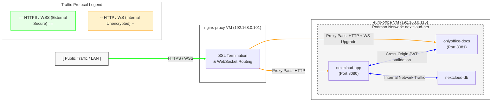
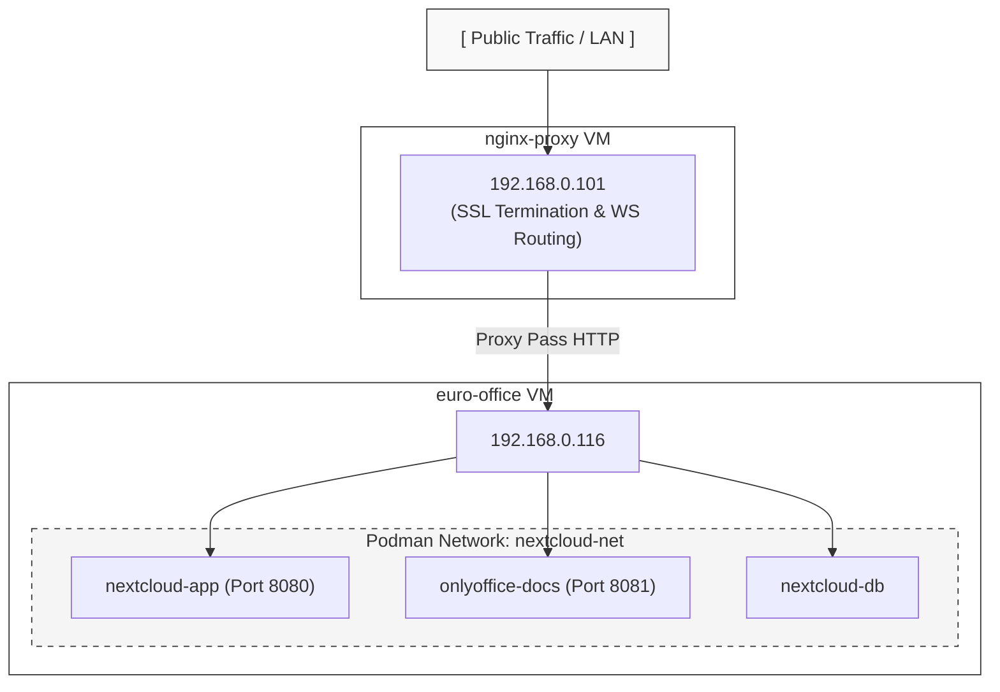

# Sovereign Digital Workspace Setup Guide

## Nextcloud & ONLYOFFICE Docs with Rootless Podman and Nginx Reverse Proxy

This document provides a step-by-step blueprint to deploy a sovereign collaborative office suite using rootless Podman and Fedora-native Quadlets on a single VM, proxied securely behind an independent Nginx instance.


## Prerequisites & Architecture




* Application VM (Host OS): Fedora Server
* Hostname: euro-office
   * IP Address: 192.168.0.116
* Reverse Proxy VM: Nginx Server
* Hostname: nginx-proxy
   * IP Address: 192.168.0.101
* Internal Port Allocations (on euro-office):
* Nextcloud Core Web Access: Port 8080
   * ONLYOFFICE Document Server Access: Port 8081

------------------------------
## Part 1: Nginx Proxy Configuration (nginx-proxy VM)
Log into the nginx-proxy (192.168.0.101) server.

Create a virtual host configuration file to route traffic to the application VM. 

Replace **://yourdomain.com** with the actual domain names.

On Ubuntu/Debian systems, the configuration file is locted at **/etc/nginx/sites-available/euro-office.conf** and enabled via a symbolic link to **/etc/nginx/sites-enabled/**. 

On RHEL/Fedora/Rocky Linux systems, the file should be created directly at **/etc/nginx/conf.d/euro-office.conf**. 

# 1. Nextcloud Frontend Proxy Block
```bash
# 1. Define your domain name environment variable
export MY_DOMAIN="gardenofrot.cc"

# 2. Overwrite office.conf with modern HTTP/2 directives
sudo tee /etc/nginx/sites-available/office.conf > /dev/null << EOF
# =========================================================================
# 1. NEXTCLOUD FRONTEND PROXY BLOCK (Port 8080)
# =========================================================================
server {
    listen 80;
    listen [::]:80;
    server_name nextcloud.${MY_DOMAIN};
    return 301 https://\$host\$request_uri;
}

server {
    listen 443 ssl;
    listen [::]:443 ssl;
    server_name nextcloud.${MY_DOMAIN};
    
    # Modern HTTP/2 Activation Directive
    http2 on;

    # SSL Certificate Paths
    ssl_certificate /etc/letsencrypt/live/${MY_DOMAIN}/fullchain.pem;
    ssl_certificate_key /etc/letsencrypt/live/${MY_DOMAIN}/privkey.pem;

    ssl_protocols TLSv1.2 TLSv1.3;
    ssl_prefer_server_ciphers off;

    # Performance and Security Headers for large file syncs
    client_max_body_size 10G; 
    fastcgi_buffers 64 4K;

    location / {
        proxy_pass http://192.168.0.116:8080;
        proxy_set_header Host \$host;
        proxy_set_header X-Real-IP \$remote_addr;
        proxy_set_header X-Forwarded-For \$proxy_add_x_forwarded_for;
        proxy_set_header X-Forwarded-Proto \$scheme;
        
        # Service Discovery Redirects for Nextcloud Sync Clients
        location ^~ /.well-known/carddav { return 301 \$scheme://\$host/remote.php/dav/; }
        location ^~ /.well-known/caldav  { return 301 \$scheme://\$host/remote.php/dav/; }
    }
}

# =========================================================================
# 2. ONLYOFFICE DOCUMENT SERVER PROXY BLOCK (Port 8081)
# =========================================================================
server {
    listen 80;
    listen [::]:80;
    server_name office.${MY_DOMAIN};
    return 301 https://\$host\$request_uri;
}

server {
    listen 443 ssl;
    listen [::]:443 ssl;
    server_name office.${MY_DOMAIN};

    # Modern HTTP/2 Activation Directive
    http2 on;

    # SSL Certificate Paths
    ssl_certificate /etc/letsencrypt/live/${MY_DOMAIN}/fullchain.pem;
    ssl_certificate_key /etc/letsencrypt/live/${MY_DOMAIN}/privkey.pem;

    ssl_protocols TLSv1.2 TLSv1.3;
    ssl_prefer_server_ciphers off;

    # Payload limits for large documents
    client_max_body_size 100M;

    location / {
        proxy_pass http://192.168.0.116:8081;

        proxy_redirect http:// \$scheme://;
        proxy_set_header Host \$host;
        proxy_set_header X-Real-IP \$remote_addr;
        proxy_set_header X-Forwarded-For \$proxy_add_x_forwarded_for;
        proxy_set_header X-Forwarded-Host \$host;
        proxy_set_header X-Forwarded-Proto https;

        # WebSocket support for live collaboration editing
        proxy_http_version 1.1;
        proxy_set_header Upgrade \$http_upgrade;
        proxy_set_header Connection "upgrade";

        # Timeouts to stop disconnects during quiet editing phases
        proxy_read_timeout 3600s;
        proxy_send_timeout 3600s;
        proxy_connect_timeout 10s;
        proxy_next_upstream error timeout invalid_header http_502;
    }
}
EOF


# Create the Symbic Link
sudo ln -s /etc/nginx/sites-available/office.conf /etc/nginx/sites-enabled/

#  Test he link worked
# 1. Test the Nginx configuration for syntax errors
sudo nginx -t

# 2. If the test passes, reload Nginx to apply changes safely
sudo systemctl reload nginx


```

------------------------------

# Part 2: System Initialization & Firewall (euro-office VM)

Log into the euro-office (192.168.0.116) server as a non-root user with sudo privileges.

```bash
# 1. Update the Debian package tree indices
sudo apt update -y

# 2. Upgrade any outdated system packages 
sudo apt upgrade -y

# 3. Install Podman natively on Debian 13
sudo apt install -y podman

# 4. Enable user lingering so containers stay running after SSH logout
sudo loginctl enable-linger $USER

# Install the native Debian firewall manager
sudo apt install -y ufw

# Allow your SSH connection first so you don't get locked out!
sudo ufw allow ssh

# Open the Nextcloud and ONLYOFFICE web ports
sudo ufw allow 8080/tcp
sudo ufw allow 8081/tcp

# Enable the firewall service
sudo ufw --force enable


echo "-> Configuring Debian rootless sub-UID namespaces..."
sudo usermod --add-subuids 100000-165535 --add-subgids 100000-165535 $USER || true
podman system migrate
# 1. Lower the secure port allocation threshold to port 80
sudo sysctl -w net.ipv4.ip_unprivileged_port_start=80

# 2. Make the port override permanent across system reboots
echo "net.ipv4.ip_unprivileged_port_start=80" | sudo tee -a /etc/sysctl.conf

# 3. Force Podman to clear its internal state and sync changes
podman system migrate

```

------------------------------

# Part 3: Storage Allocation & User Namespace Adjustment


```bash
cat << 'EOF' > step3_storage.sh
#!/bin/bash
set -e

echo "=== [Step 3] Initializing Podman Volume Infrastructure ==="

# Cache sudo credentials upfront so the script runs unattended
sudo -v


# List of required volumes
VOLUMES=("nc-db-data" "nc-app-data" "nc-app-config" "oo-data" "oo-logs")

# 1. Destructive check and initialization loop
echo "-> Provisioning Podman volumes (Wiping existing data if found)..."
for vol in "${VOLUMES[@]}"; do
    if podman volume exists "$vol"; then
        echo "   [!] Volume '$vol' already exists. Purging and resetting..."
        podman volume rm -f "$vol"
    fi
    podman volume create "$vol"
done

# 2. Extract physical host volume mount directory points
echo "-> Extracting volume mountpoints..."
CONFIG_PATH=$(podman volume inspect nc-app-config --format '{{.Mountpoint}}')
DATA_PATH=$(podman volume inspect nc-app-data --format '{{.Mountpoint}}')

# 3. Shift directory execution permissions to UID 33 (www-data) inside rootless space
echo "-> Realignment of user namespaces for Nextcloud internal engines..."
podman unshare chown -R 33:33 "$CONFIG_PATH"
podman unshare chown -R 33:33 "$DATA_PATH"

echo "=== [Step 3] Storage infrastructure deployed cleanly! ==="
EOF

# Make the script executable
chmod +x step3_storage.sh

# Execute the updated step 3 storage deployment script
./step3_storage.sh

```

------------------------------
# Part 4: Provision Quadlet Service Definitions

Create the automated container layouts using systemd Quadlets.

```bash
cat << 'EOF' > step4_quadlets.sh
#!/bin/bash
set -e

echo "=== [Step 4] Orchestrating Quadlet Deployment & Lifecycle ==="

# 1. Establish absolute systemd environment linkages for Debian 13
export XDG_RUNTIME_DIR="/run/user/$(id -u)"
export DBUS_SESSION_BUS_ADDRESS="unix:path=${XDG_RUNTIME_DIR}/bus"

TARGET_DIR="${HOME}/.config/containers/systemd"
FILES=("nextcloud-db.container" "onlyoffice-docs.container" "nextcloud-app.container")

# =========================================================================
# 2. GENERATE STATIC CONFIGURATION FILES (Clean, Decoupled Git-Safe Assets)
# =========================================================================
echo "-> Generating static Quadlet configuration files locally..."

# 1. PostgreSQL Database definition (Removed network dot dependency)
cat << 'LOCAL_EOF' > nextcloud-db.container
[Unit]
Description=Nextcloud PostgreSQL Database

[Container]
ContainerName=nextcloud-db
Image=docker.io/library/postgres:15-alpine
Network=nextcloud-net
Volume=nc-db-data:/var/lib/postgresql/data:Z
Environment=POSTGRES_DB=nextcloud POSTGRES_USER=nextcloud_user POSTGRES_PASSWORD=YourSecurePasswordHere

[Install]
WantedBy=default.target
LOCAL_EOF

# 2. ONLYOFFICE Document Server definition
cat << 'LOCAL_EOF' > onlyoffice-docs.container
[Unit]
Description=ONLYOFFICE Document Server

[Container]
ContainerName=onlyoffice-docs
Image=docker.io/onlyoffice/documentserver:latest
Network=nextcloud-net
PublishPort=8081:80
Volume=oo-data:/var/www/onlyoffice/Data:Z
Volume=oo-logs:/var/log/onlyoffice:Z
Environment=JWT_ENABLED=true JWT_SECRET=YourSuperSecretJWTKeyHere JWT_HEADER=Authorization

[Install]
WantedBy=default.target
LOCAL_EOF

# 3. Nextcloud Core App Engine definition
cat << 'LOCAL_EOF' > nextcloud-app.container
[Unit]
Description=Nextcloud Application Server
After=nextcloud-db.service onlyoffice-docs.service

[Container]
ContainerName=nextcloud-app
Image=docker.io/library/nextcloud:stable
Network=nextcloud-net
PublishPort=8080:80
Volume=nc-app-data:/var/www/html:Z
Volume=nc-app-config:/var/www/html/config:Z

# FIX: Forces internal loopbacks to resolve locally via the proxy, bypassing Hairpin NAT limits
AddHost=office.gardenofrot.cc:192.168.0.101
AddHost=nextcloud.gardenofrot.cc:192.168.0.101

Environment=POSTGRES_HOST=nextcloud-db POSTGRES_DB=nextcloud POSTGRES_USER=nextcloud_user POSTGRES_PASSWORD=YourSecurePasswordHere NEXTCLOUD_ADMIN_USER=admin NEXTCLOUD_ADMIN_PASSWORD=YourSecureAdminPassword

[Install]
WantedBy=default.target
LOCAL_EOF

# =========================================================================
# 3. NATIVE PODMAN NETWORK ASSURANCE & SYSTEMD INJECTION
# =========================================================================

# Stop previous failed service iterations to clear execution locks
echo "-> Hard stopping old environment stacks..."
systemctl --user stop nextcloud-app.service onlyoffice-docs.service nextcloud-db.service 2>/dev/null || true
systemctl --user reset-failed 2>/dev/null || true

# Explicitly create the Podman user network if it doesn't already exist
echo "-> Verifying and creating rootless network mesh (nextcloud-net)..."
if ! podman network exists nextcloud-net; then
    podman network create nextcloud-net
else
    echo "   Network mesh already active."
fi

# Refresh target configuration directory paths and purge old broken files
echo "-> Syncing layout files to systemd user paths..."
mkdir -p "$TARGET_DIR"
rm -f "$TARGET_DIR/nextcloud-net.network" # Wipe the old network unit file causing conflicts

for file in "${FILES[@]}"; do
    cp "$file" "$TARGET_DIR/"
done

# Compile definitions into active systemd services
echo "-> Re-compiling systemd user service structures..."
systemctl --user daemon-reload

# Launch the fully compiled application stack sequentially
echo "-> Launching backend engine stacks..."
systemctl --user start nextcloud-db.service onlyoffice-docs.service

echo "-> Mounting nextcloud frontend interface..."
systemctl --user start nextcloud-app.service

echo "=== [Step 4] Quadlet environment deployed and started cleanly! ==="
EOF

# Ensure script is executable
chmod +x step4_quadlets.sh

# Run the updated runner script
./step4_quadlets.sh

```

## Verify
```bash
paul@euro-office:~$ podman ps
CONTAINER ID  IMAGE                                       COMMAND               CREATED             STATUS             PORTS                          NAMES
54d9a1233fc7  docker.io/onlyoffice/documentserver:latest                        2 minutes ago       Up 2 minutes       0.0.0.0:8081->80/tcp, 443/tcp  onlyoffice-docs
1bb1d3e6a0a0  docker.io/library/postgres:15-alpine        postgres              2 minutes ago       Up 2 minutes       5432/tcp                       nextcloud-db
229512a4eb37  docker.io/library/nextcloud:stable          apache2-foregroun...  About a minute ago  Up About a minute  0.0.0.0:8080->80/tcp           nextcloud-app
paul@euro-office:~$

## check Service
journalctl --user -u nextcloud-app.service -n 50 --no-pager

```

------------------------------

## Part 5: Initialize the Complete Environment Stack

```bash
cat << 'EOF' > step5_integration.sh
#!/bin/bash
set -e

echo "=== [Step 5] Initializing Stack & Injecting Proxy Rules ==="

# 1. Establish absolute systemd environment linkages for Debian 13
export XDG_RUNTIME_DIR="/run/user/$(id -u)"
export DBUS_SESSION_BUS_ADDRESS="unix:path=${XDG_RUNTIME_DIR}/bus"

# 2. Part 5: Refresh context and start up the full environment stack cleanly
echo "-> Refreshing systemd user context structures..."
systemctl --user daemon-reload

echo "-> Spawning service definitions..."
systemctl --user start nextcloud-db.service onlyoffice-docs.service nextcloud-app.service

echo "-> Pausing for 30 seconds to let database table migrations settle..."
sleep 30

# 3. Dynamic Loop: Wait until Nextcloud's core interface is completely ready for configurations
echo "-> Checking Nextcloud command-line availability..."
for i in {1..30}; do
    if podman exec -u www-data nextcloud-app php occ status >/dev/null 2>&1; then
        echo "   [+] Nextcloud engine is ready for configurations."
        break
    fi
    if [ "$i" -eq 30 ]; then
        echo "   [!] Error: Nextcloud failed to initialize within expected timeframes." >&2
        exit 1
    fi
    echo "   [-] Waiting for internal container installation loops (Attempt $i/30)..."
    sleep 5
done

# =========================================================================
# Part 6: Reverse Proxy Integration & Domain Whitelisting
# =========================================================================

# 1. Allow ONLYOFFICE to query across private container networks
echo "-> Modifying ONLYOFFICE cross-origin private network query rules..."
podman exec -it onlyoffice-docs sed -i 's/"allowPrivateIPAddress": false/"allowPrivateIPAddress": true/g' /etc/onlyoffice/documentserver/default.json
podman exec -it onlyoffice-docs supervisorctl restart all > /dev/null

# 2. Grant Nextcloud authorization to route local backend loops
echo "-> Allowing Nextcloud to make local internal network calls..."
podman exec -u www-data nextcloud-app php occ config:system:set allow_local_remote_servers --value=true --type=boolean

# 3. Add the Reverse Proxy IP (192.168.0.101) to Nextcloud Trusted Proxies
echo "-> Whitelisting nginx-proxy (192.168.0.101) as a trusted gateway..."
podman exec -u www-data nextcloud-app php occ config:system:set trusted_proxies 0 --value="192.168.0.101"

# 4. Whitelist both local IP paths and the external domain strings
echo "-> Binding trusted local and public domains..."
podman exec -u www-data nextcloud-app php occ config:system:set trusted_domains 1 --value="192.168.0.116"
podman exec -u www-data nextcloud-app php occ config:system:set trusted_domains 2 --value="nextcloud.gardenofrot.cc"
podman exec -u www-data nextcloud-app php occ config:system:set trusted_domains 3 --value="office.gardenofrot.cc"

# 5. Tell Nextcloud to pass web headers correctly through SSL
echo "-> Enforcing SSL proxy headers and routing overwrite flags..."
podman exec -u www-data nextcloud-app php occ config:system:set overwritehost --value="nextcloud.gardenofrot.cc"
podman exec -u www-data nextcloud-app php occ config:system:set overwriteprotocol --value="https"

# 6. Fetch and deploy the official ONLYOFFICE plugin bundle straight into Nextcloud
echo "-> Injecting ONLYOFFICE workspace extension module (Downloading)..."
podman exec -it -u www-data nextcloud-app php occ app:install onlyoffice

echo "=== [Step 5] Script orchestration complete! Environment fully integrated. ==="
EOF

# Make the integration script executable
chmod +x step5_integration.sh

# Run the complete integration script
./step5_integration.sh

```
## Verify 
```bash
podman exec -u www-data nextcloud-app php occ config:list system
```

--- 

## Part 6: Reverse Proxy Integration & Domain Whitelisting

Because traffic passes through the external Nginx reverse proxy, you must instruct both apps to accept requests coming from the domains and proxy IPs.

```bash 
cat << 'EOF' > step6_linkage.sh
#!/bin/bash
set -e

echo "=== [Step 6] Finalising ONLYOFFICE & Nextcloud App Linkage ==="

# 1. Define your domain name environment variable
export MY_DOMAIN="gardenofrot.cc"

# 2. Establish absolute systemd environment linkages for Debian 13
export XDG_RUNTIME_DIR="/run/user/$(id -u)"
export DBUS_SESSION_BUS_ADDRESS="unix:path=${XDG_RUNTIME_DIR}/bus"

# 3. Check that the required containers are active before running commands
if ! podman ps | grep -q "nextcloud-app"; then
    echo "   [!] Error: nextcloud-app container is not running. Run step4 and step5 first." >&2
    exit 1
fi

# =========================================================================
# SYSTEM CONFIGURATION INJECTION (Direct App Settings)
# =========================================================================

echo "-> Setting public ONLYOFFICE Docs Document Server address..."
podman exec -u www-data nextcloud-app php occ config:app:set onlyoffice DocumentServerUrl --value="https://office.${MY_DOMAIN}/"

echo "-> Injecting secure JWT authentication secret key..."
# Force overwrites the internal app value to clear browser defaults
podman exec -u www-data nextcloud-app php occ config:app:set onlyoffice DocumentServerSecret --value="YourSuperSecretJWTKeyHere"

echo "-> Mapping advanced internal network request routing hooks..."
podman exec -u www-data nextcloud-app php occ config:app:set onlyoffice DocumentServerInternalUrl --value="http://onlyoffice-docs/"
podman exec -u www-data nextcloud-app php occ config:app:set onlyoffice StorageUrl --value="http://nextcloud-app/"

# =========================================================================
# CONFIGURATION INTEGRITY VALIDATION
# =========================================================================

echo "-> Verifying registered configuration values..."
echo "--------------------------------------------------------"
podman exec -u www-data nextcloud-app php occ config:app:get onlyoffice DocumentServerUrl | sed 's/^/  DocumentServerUrl: /'
podman exec -u www-data nextcloud-app php occ config:app:get onlyoffice DocumentServerInternalUrl | sed 's/^/  DocumentServerInternalUrl: /'
podman exec -u www-data nextcloud-app php occ config:app:get onlyoffice StorageUrl | sed 's/^/  StorageUrl: /'
echo "--------------------------------------------------------"

echo "=== [Step 6] Script orchestration complete! Sovereign Office suite is fully live. ==="
EOF

# Ensure script execution rights are preserved
chmod +x step6_linkage.sh


# Run the updated, variable-driven linkage script
./step6_linkage.sh


```

------------------------------
## Part 7: Finalize Integration in Web Browser


```bash 
# get ADMIN password
podman exec -it nextcloud-app env | grep NEXTCLOUD_ADMIN_PASSWORD

```

open https://nextcloud.gardenofrot.cc/apps/dashboard/

Admin panel is not need as it all on one server


   1. Open the browser and go to the public address: https://yourdomain.com
   2. Authenticate using the deployment credentials (admin / YourSecureAdminPassword).
   3. Click the profile icon (top right corner) ➔ Administration settings.
   4. Select ONLYOFFICE on the bottom left navigation tree menu.
   5. Expand the Advanced server settings tab to bypass proxy loop limits:
   * ONLYOFFICE Docs address: https://yourdomain.com
      * Secret key: YourSuperSecretJWTKeyHere
      * ONLYOFFICE Docs address for internal requests from the server: http://onlyoffice-docs/
      * Nextcloud address for internal requests from the document server: http://nextcloud-app/
   6. Press Save. the collaborative workspace environment is ready.


------------------
## Part 8: Master script and readme.
```bash
cat << 'EOF' > master_deploy.sh
#!/bin/bash
set -e

echo "========================================================================="
echo "🚀 STARTING MASTER DEPLOYMENT: SOVEREIGN DIGITAL WORKSPACE"
echo "========================================================================="

# 1. Establish absolute systemd environment linkages for Debian 13
export XDG_RUNTIME_DIR="/run/user/$(id -u)"
export DBUS_SESSION_BUS_ADDRESS="unix:path=${XDG_RUNTIME_DIR}/bus"

# Cache sudo credentials upfront so the script runs unattended
sudo -v

# 2. Check for required local static configuration files
FILES=("nextcloud-db.container" "onlyoffice-docs.container" "nextcloud-app.container")
for file in "${FILES[@]}"; do
    if [ ! -f "$file" ]; then
        echo "   [!] Error: Critical file '$file' missing from working directory." >&2
        echo "       Please execute ./step4_quadlets.sh once to populate static assets." >&2
        exit 1
    fi
done

# 3. Sequential Orchestration Pipeline
echo ""
echo "👉 Running Step 3: Initializing Storage Infrastructure..."
./step3_storage.sh

echo ""
echo "👉 Running Step 4: Compiling & Syncing Quadlet Service Matrix..."
./step4_quadlets.sh

echo ""
echo "👉 Running Step 5: Provisioning Domain Whitelists & Extension Engine..."
./step5_integration.sh

echo ""
echo "👉 Running Step 6: Finalizing Cryptographic Application Handshakes..."
./step6_linkage.sh

echo ""
echo "========================================================================="
echo "🎉 SUCCESS: Environment is fully operational and tracked in version control!"
echo "========================================================================="
podman ps
EOF

# Make the master script executable
chmod +x master_deploy.sh
```

## master readme.md

```bash
cat << 'EOF' > README.md
# Sovereign Collaborative Workspace Setup Guide
### Nextcloud Hub & ONLYOFFICE Docs with Rootless Podman and Systemd Quadlets

This repository provides an production-ready blueprint to deploy an automated collaborative office suite. It utilizes rootless **Podman**, Debian-native **Quadlets** for systemd process management, and an external Nginx load-balancer for SSL termination and secure WebSocket routing.

---

## 🧭 Infrastructure Architecture


```

------------------------------
## Maintenance & Lifecycle Commands

* Stop Ecosystem: systemctl --user stop nextcloud-app onlyoffice-docs nextcloud-db
* Start Ecosystem: systemctl --user start nextcloud-db onlyoffice-docs nextcloud-app
* Restart Ecosystem: systemctl --user restart nextcloud-db onlyoffice-docs nextcloud-app
* Review Live Event Logs: journalctl --user -u nextcloud-app.service -f

------------------------------
Would you like help generating Let's Encrypt SSL certificates via certbot on the Nginx proxy server, or would you like to verify the internal Podman logs if a container fails to start?

