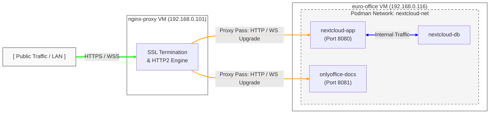

# Sovereign Collaborative Workspace Setup Guide
### Nextcloud Hub & ONLYOFFICE Docs with Rootless Podman and Systemd Quadlets

This repository provides an production-ready blueprint to deploy an automated collaborative office suite. It utilizes rootless **Podman**, Debian-native **Quadlets** for systemd process management, and an external Nginx load-balancer for SSL termination and secure WebSocket routing.

---

## 🧭 Infrastructure Architecture




### Resource Matrix
* **Reverse Proxy Host**: `nginx-proxy` (`192.168.0.101`)
* **Application Host**: `euro-office` (`192.168.0.116`) — Debian 13 VM
* **Public Domain Mapping**:
  * Nextcloud Interface: `https://gardenofrot.cc`
  * ONLYOFFICE Core Engine: `https://gardenofrot.cc`

---

## 🛠️ Step 1: External Proxy Setup (`nginx-proxy` VM)

Place this unified block inside your Nginx configuration directory (e.g., `/etc/nginx/sites-available/office.conf`). Enable it using `ln -sf` to your active configurations path.

```nginx
# 1. Nextcloud Frontend Proxy Block
server {
    listen 80;
    listen [::]:80;
    server_name nextcloud.gardenofrot.cc;
    return 301 https://\(host\)request_uri;
}

server {
    listen 443 ssl;
    listen [::]:443 ssl;
    server_name nextcloud.gardenofrot.cc;
    http2 on;

    ssl_certificate /etc/letsencrypt/live/gardenofrot.cc/fullchain.pem;
    ssl_certificate_key /etc/letsencrypt/live/gardenofrot.cc/privkey.pem;
    ssl_protocols TLSv1.2 TLSv1.3;
    ssl_prefer_server_ciphers off;

    client_max_body_size 10G; 
    fastcgi_buffers 64 4K;

    location / {
        proxy_pass http://192.168.0.116:8080;
        proxy_set_header Host \$host;
        proxy_set_header X-Real-IP \$remote_addr;
        proxy_set_header X-Forwarded-For \$proxy_add_x_forwarded_for;
        proxy_set_header X-Forwarded-Proto \$scheme;
        
        location ^~ /.well-known/carddav { return 301 \(scheme://\)host/remote.php/dav/; }
        location ^~ /.well-known/caldav  { return 301 \(scheme://\)host/remote.php/dav/; }
    }
}

# 2. ONLYOFFICE Document Server Proxy Block
server {
    listen 80;
    listen [::]:80;
    server_name office.gardenofrot.cc;
    return 301 https://\(host\)request_uri;
}

server {
    listen 443 ssl;
    listen [::]:443 ssl;
    server_name office.gardenofrot.cc;
    http2 on;

    ssl_certificate /etc/letsencrypt/live/gardenofrot.cc/fullchain.pem;
    ssl_certificate_key /etc/letsencrypt/live/gardenofrot.cc/privkey.pem;
    ssl_protocols TLSv1.2 TLSv1.3;
    ssl_prefer_server_ciphers off;

    client_max_body_size 100M;

    location / {
        proxy_pass http://192.168.0.116:8081;
        proxy_redirect http:// \$scheme://;
        proxy_set_header Host \$host;
        proxy_set_header X-Real-IP \$remote_addr;
        proxy_set_header X-Forwarded-For \$proxy_add_x_forwarded_for;
        proxy_set_header X-Forwarded-Host \$host;
        proxy_set_header X-Forwarded-Proto https;

        # WebSocket support
        proxy_http_version 1.1;
        proxy_set_header Upgrade \$http_upgrade;
        proxy_set_header Connection "upgrade";

        proxy_read_timeout 3600s;
        proxy_send_timeout 3600s;
        proxy_connect_timeout 10s;
        proxy_next_upstream error timeout invalid_header http_502;
    }
}
```

---

## 🚀 Step 2: Automation Execution Script Pipeline (`euro-office` VM)

Log into your target `euro-office` machine as your unprivileged user. Clone your tracking repository and configure your kernel-level unprivileged port variables first:

```bash
# Force the system kernel to allow unprivileged port mapping starting at port 80
sudo sysctl -w net.ipv4.ip_unprivileged_port_start=80
echo "net.ipv4.ip_unprivileged_port_start=80" | sudo tee -a /etc/sysctl.conf
podman system migrate
```

Now, fire the entire idempotent pipeline with a single master command execution sequence:

```bash
# Execute the deployment engine
./master_deploy.sh
```

---

## 📦 Maintenance & Service Lifecycle Utilities

Manage the container operational boundaries natively using systemd user tooling profiles:

*   **Halt the Ecosystem**: 
    `systemctl --user stop nextcloud-app onlyoffice-docs nextcloud-db`
*   **Launch the Ecosystem**: 
    `systemctl --user start nextcloud-db onlyoffice-docs nextcloud-app`
*   **Restart the Ecosystem**: 
    `systemctl --user restart nextcloud-db onlyoffice-docs nextcloud-app`
*   **Inspect Live Log Events**: 
    `journalctl --user -u nextcloud-app.service -f`
EOF

------------------------------
## 🔐 Secrets handling

This repository must not contain real secrets. All passwords, JWT secrets and admin credentials in the examples are redacted. Deployments should provide real secrets via Kubernetes Secrets, an external vault, or environment injection at runtime. See `nextcloud-secrets.example.yaml` for a template to create Kubernetes Secrets and update manifests to use `valueFrom.secretKeyRef`.

Follow these steps after editing the example manifest:
- Populate secure values into `nextcloud-secrets.example.yaml` or create secrets directly with `kubectl create secret`.
- Update Deployment manifests to reference secrets with `valueFrom.secretKeyRef` instead of hard-coded `value:` fields.
- Rotate any credentials if they were previously used in production and were committed accidentally.

## 📂 Your Completed Version-Controlled Workspace Blueprint
Run git status right now, and you will see your production tracking manifest ready for staging:

git status

Tracked Architecture Assets:

* nextcloud-db.container (Database Definition)
* onlyoffice-docs.container (Office Engine Definition)
* nextcloud-app.container (Core Application Definition)
* step3_storage.sh (Storage Reset & Mapping Utility)
* step4_quadlets.sh (Quadlet Generator Loop)
* step5_integration.sh (Trusted Domains & Extensions Proxy)
* step6_linkage.sh (Automated JWT Handshake Core)
* master_deploy.sh (The Master Deployment Orchestrator)
* README.md (Production Infrastructure Reference Manual)

## 💾 Commit Your Workspace Structure
Stage your files and lock down your tracking repository by executing:

git add .
git commit -m "feat: deploy automated idempotent rootless nextcloud and onlyoffice workspace suite"

Everything is fully complete, working, and safely saved in your local repo! Are there any additional configuration overrides or security tuning options you would like to tackle next?

