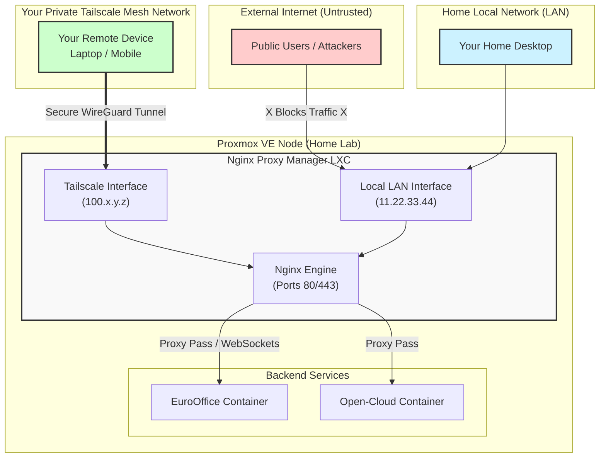
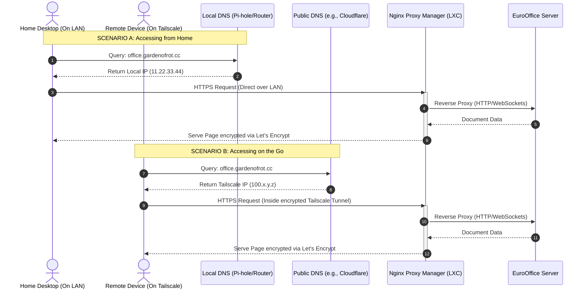

------------------------------
## Access Services via Proxy and Tailscale.

* No Public Port Forwarding: Your home network remains invisible to automated internet scanners.
* SSL via Tailscale MagicDNS: Tailscale can automatically provision valid, free Let's Encrypt certificates for your Tailscale machine names.
* Unified Domain: You can use split-horizon DNS so office.gardenofrot.cc works seamlessly whether you are sitting at your home desk or away on mobile data.

------------------------------
## Architecture Overview
Deploy a Nginx Proxy Manager (NPM) LXC container. NPM provides a clean web interface to manage your SSL certificates and routing rules.  

```text
[Local Home Network] --------> [ Nginx Proxy Manager ] ----> [EuroOffice LXC/VM]
                                       ^
[External Tailscale Device] -----------+ (Via Tailscale IP)
```





------------------------------

# Setup NGINX on a Debian VM 

   ```bash 
sudo apt update
sudo apt install nginx -y

sudo nano /etc/nginx/sites-available/mysite.conf
```

```conf
server {
    listen 80;
    listen [::]:80;
    server_name gardenofrot.cc www.gardenofrot.cc 192.168.0.101;

    location / {
        proxy_pass http://127.0.0.1:8080;
        proxy_set_header Host $host;
        proxy_set_header X-Real-IP $remote_addr;
        proxy_set_header X-Forwarded-For $proxy_add_x_forwarded_for;
        proxy_set_header X-Forwarded-Proto $scheme;
    }
}

```

Apply the ChangesTest the configuration file for syntax errors:bashsudo 
```bash

# Check resolts are Okay
sudo nginx -t

# reload Nginx
sudo systemctl reload nginx
sudo systemctl status nginx

# check it.
curl -I http://127.0.0.1
curl -I http://192.168.0.101

# Look at logs
sudo tail -f /var/log/nginx/access.log


```
## Step 3: Configure DNS for office.gardenofrot.cc
You need to point your domain name to the proxy server. Because you want it to work both locally and via Tailscale, use this strategy:

* For Tailscale/External Access: Go to your domain registrar (where gardenofrot.cc is hosted) and create a DNS A Record:
* Host/Name: office
   * Value: Your proxy container's Tailscale IP (100.x.y.z).
   * Note: Since Tailscale IPs are private to your network, public users still won't be able to access it. [11] 
* For Local-Only Access (Optional but recommended): If your home router supports custom DNS entry overrides (like Pi-hole, AdGuard Home, or pfSense/OPNsense), add a local DNS map:
* office.gardenofrot.cc -> Local Proxy IP (11.22.33.44).
   * This ensures local traffic stays incredibly fast and doesn't route through the Tailscale software layer unnecessarily. [12, 13] 


# Get Certificates from Let's Encypt and CloudFlare
Running bare-metal Nginx running directly on the host (instead of the Dockerised Nginx Proxy Manager). 

To automate your Let's Encrypt Wildcard SSL certificate using your Cloudflare DNS-01 challenge on native Nginx, use Certbot along with its Cloudflare DNS plugin.

## Step 1: Install Certbot and the Cloudflare Plugin
Run these commands on the nginx-proxy VM to pull down the necessary automation packages:

```bash
sudo apt update
sudo apt install certbot python3-certbot-nginx python3-certbot-dns-cloudflare -y
```

## Step 2: Configure Your Cloudflare API Credentials
Certbot needs your Cloudflare token to create the temporary DNS records.

  1. Create a secure directory and file to store your credentials:
  
```bash 
   sudo mkdir -p /etc/letsencrypt
   sudo nano /etc/letsencrypt/cloudflare.ini
```

   2. Paste the following line inside, replacing the placeholder with your actual Cloudflare API Token (the one with Zone:DNS:Edit permissions):
   ```ini
   dns_cloudflare_api_token = YOUR_ACTUAL_CLOUDFLARE_API_TOKEN
   ```
   3. Secure the file permissions so other system users cannot read your token:
```bash   
   sudo chmod 600 /etc/letsencrypt/cloudflare.ini
```

## Step 3: Issue the Wildcard Certificate

Run Certbot using the DNS-01 challenge. This will fetch one certificate that covers your root domain and all possible subdomains (like auth., office., pihole., etc.): [2, 3] 

instruct Certbot to temporarily switch to public DNS only for the split-second it takes to renew your certificates, and then exit. We achieve this using a Certbot config override.Run these steps to lock down automated renewals forever:Step 1: Create a Dedicated Renewal Hook Directory


## In Pihole conditional Forwarding

Very important, in PiHole enter this for the condional forwarding.
```text
true, 1.1.1.1, _acme-challenge.gardenofrot.cc
```

```bash
sudo certbot certonly \
  --dns-cloudflare \
  --dns-cloudflare-credentials /etc/letsencrypt/cloudflare.ini \
  --dns-cloudflare-propagation-seconds 60 \
  --agree-tos \
  -m paul.mckee.aus@gmail.com \
  -d gardenofrot.cc \
  -d "*.gardenofrot.cc"


```
(Certbot will run the challenge, talk to Cloudflare, and save your new keys inside /etc/letsencrypt/live/gardenofrot.cc/). 


## Push cert to the Encrypted Onl;yOffice Route Live

```bash
sudo nano /etc/nginx/sites-available/office.conf
```

```json
server {
    listen 80;
    server_name office.gardenofrot.cc;
    return 301 https://$host$request_uri;
}

server {
    listen 443 ssl;
    server_name office.gardenofrot.cc;

    ssl_certificate /etc/letsencrypt/live/gardenofrot.cc/fullchain.pem;
    ssl_certificate_key /etc/letsencrypt/live/gardenofrot.cc/privkey.pem;

    ssl_protocols TLSv1.2 TLSv1.3;
    ssl_prefer_server_ciphers off;

    location / {
        proxy_pass http://192.168.0.133:8080;

        proxy_set_header Host $host;
        proxy_set_header X-Real-IP $remote_addr;
        proxy_set_header X-Forwarded-For $proxy_add_x_forwarded_for;
        proxy_set_header X-Forwarded-Proto $scheme;

        # WebSocket parameters (Crucial for OnlyOffice document sync)
        proxy_http_version 1.1;
        proxy_set_header Upgrade $http_upgrade;
        proxy_set_header Connection "upgrade";
    }
}

```

Verify
```bash
sudo nginx -t
sudo systemctl restart nginx
```

```bash
sudo ln -s /etc/nginx/sites-available/office.conf /etc/nginx/sites-enabled/
sudo nano /etc/nginx/sites-available/office.conf
sudo nginx -t
sudo systemctl restart nginx

```

Content should match this:
```json
server {
    listen 80;
    server_name office.gardenofrot.cc;
    return 301 https://$host$request_uri;
}

server {
    listen 443 ssl;
    server_name office.gardenofrot.cc;

    # Ensure these paths look exactly like this
    ssl_certificate /etc/letsencrypt/live/gardenofrot.cc/fullchain.pem;
    ssl_certificate_key /etc/letsencrypt/live/gardenofrot.cc/privkey.pem;

    ssl_protocols TLSv1.2 TLSv1.3;
    ssl_prefer_server_ciphers off;

      location / {
        # 1. Change http to https and point to OnlyOffice's secure port
        proxy_pass https://192.168.0.116:8443; # Make sure this matches OnlyOffice's HTTPS port

        # 2. Tell Nginx to ignore the untrusted self-signed backend cert
        proxy_ssl_verify off;
        proxy_ssl_session_reuse on;
        proxy_ssl_server_name on;

        # 3. Standard proxy headers
        proxy_set_header Host $host;
        proxy_set_header X-Real-IP $remote_addr;
        proxy_set_header X-Forwarded-For $proxy_add_x_forwarded_for;
        proxy_set_header X-Forwarded-Proto $scheme;

        # 4. WebSocket support
        proxy_http_version 1.1;
        proxy_set_header Upgrade $http_upgrade;
        proxy_set_header Connection "upgrade";
    }

}

```

------------------------------
## Step 4: Update Your Nginx Configurations for HTTPS (Port 443)
Now we will upgrade your configuration files to enforce SSL. 

## 1. Upgrade your existing office.conf file:
```bash
sudo nano /etc/nginx/sites-available/office.conf
```
Replace the entire file with this layout. It listens securely on 443, injects the Let's Encrypt keys, and forces regular HTTP (80) users to redirect to HTTPS: 
```json
server {
    listen 80;
    server_name office.gardenofrot.cc;
    return 301 https://$host$request_uri;
}

server {
    listen 443 ssl;
    server_name office.gardenofrot.cc;

    ssl_certificate /etc/letsencrypt/live/gardenofrot.cc/fullchain.pem;
    ssl_certificate_key /etc/letsencrypt/live/gardenofrot.cc/privkey.pem;

    location / {
        proxy_pass http://192.168.0.133:8080;

        proxy_set_header Host $host;
        proxy_set_header X-Real-IP $remote_addr;
        proxy_set_header X-Forwarded-For $proxy_add_x_forwarded_for;
        proxy_set_header X-Forwarded-Proto $scheme;

        # WebSocket support
        proxy_http_version 1.1;
        proxy_set_header Upgrade $http_upgrade;
        proxy_set_header Connection "upgrade";
    }
}
```

## 2. Create your new authentik.conf file:

``bash
sudo nano /etc/nginx/sites-available/authentik.conf
```
Paste this layout. Change 192.168.0.X to the actual IP address of the server where you intend to deploy your Authentik Docker container:
```json
server {
    listen 80;
    server_name auth.gardenofrot.cc;
    return 301 https://$host$request_uri;
}

server {
    listen 443 ssl;
    server_name auth.gardenofrot.cc;

    ssl_certificate /etc/letsencrypt/live/gardenofrot.cc/fullchain.pem;
    ssl_certificate_key /etc/letsencrypt/live/gardenofrot.cc/privkey.pem;

    location / {
        proxy_pass http://192.168.0.X:8000; # Change to your Authentik Host IP

        proxy_set_header Host $host;
        proxy_set_header X-Real-IP $remote_addr;
        proxy_set_header X-Forwarded-For $proxy_add_x_forwarded_for;
        proxy_set_header X-Forwarded-Proto $scheme;

        # WebSocket support (Crucial for Authentik admin real-time websocket connections)
        proxy_http_version 1.1;
        proxy_set_header Upgrade $http_upgrade;
        proxy_set_header Connection "upgrade";
    }
}
```

------------------------------
## Step 5: Enable configurations and Restart Nginx

 
   
   2. Test your Nginx configuration syntax:
```bash   
  # Enable the new Authentik configuration layout by symlinking it:
   
   sudo ln -s /etc/nginx/sites-available/authentik.conf /etc/nginx/sites-enabled/
   sudo nginx -t

   # If it says syntax is ok, reload Nginx to push everything live:
   sudo systemctl restart nginx
```   


=====================
## Step 4: Generate SSL Certificates in NPM
EuroOffice requires an HTTPS connection to communicate securely with cloud platforms.

   1. Log into Nginx Proxy Manager (http://11.22.33.44:81).
   2. Go to SSL Certificates > Add SSL Certificate > Let's Encrypt.
   3. Enter office.gardenofrot.cc.
   4. Turn on Use a DNS Challenge (Choose your DNS provider from the dropdown, e.g., Cloudflare, GoDaddy, etc., and paste your API token). This is required because Let's Encrypt cannot verify your server via standard HTTP ports since they are closed to the public internet.
   5. Agree to the terms and click Save. [14, 15, 16, 17] 

## Step 5: Create the Proxy Routes
Now, link your domain to the EuroOffice and Open-Cloud backend instances.

   1. In NPM, go to Hosts > Proxy Hosts > Add Proxy Host.
   2. Details Tab:
   * Domain Names: office.gardenofrot.cc
      * Scheme: http (or https depending on how EuroOffice is configured internally).
      * Forward Hostname / IP: The internal Proxmox IP of your EuroOffice container.
      * Forward Port: The port EuroOffice listens on (usually 80 or 8080).
      * Turn ON Websockets Support (EuroOffice relies heavily on websockets for real-time document editing).
   3. SSL Tab:
   * Select your newly created office.gardenofrot.cc certificate.
      * Turn ON Force SSL and HTTP/2 Support.
   4. Click Save.

------------------------------
## Step 6: Connect Open-Cloud to EuroOffice
Log into your Open-Cloud/Nextcloud instance via your browser. Navigate to the EuroOffice integration settings and update the server address field to your official new production address: https://office.gardenofrot.cc.
Which DNS provider (Cloudflare, Namecheap, AWS, etc.) are you using for gardenofrot.cc? I can give you the exact steps to set up the DNS challenge API tokens for your SSL certificate. [18] 

[1] [https://www.reddit.com](https://www.reddit.com/r/homelab/comments/17uf2dp/using_reverse_proxy_for_home_server/)
[2] [https://www.xda-developers.com](https://www.xda-developers.com/this-is-my-favorite-lxc-on-proxmox-and-its-not-what-you-think/)
[3] [https://www.reddit.com](https://www.reddit.com/r/Tailscale/comments/1hl97nf/tailscale_with_adguard_home_and_cf_domain/)
[4] [https://www.youtube.com](https://www.youtube.com/watch?v=nrOB3UuZaU4)
[5] [https://www.reddit.com](https://www.reddit.com/r/Tailscale/comments/1dwaca7/tailscale_forward_proxy_docker_setup/)
[6] [https://www.reddit.com](https://www.reddit.com/r/Tailscale/comments/1lg60cg/help_with_tailscale_reverse_proxy/)
[7] [https://ente.com](https://ente.com/help/self-hosting/guides/tailscale)
[8] [https://blog.stackademic.com](https://blog.stackademic.com/from-a-raspberry-pi-travel-router-to-a-full-self-hosted-home-lab-da5a13e40188)
[9] [https://fullmetalbrackets.com](https://fullmetalbrackets.com/blog/expose-plex-tailscale-vps)
[10] [https://www.reddit.com](https://www.reddit.com/r/Tailscale/comments/1ml3cqy/how_do_i_use_my_own_domains_for_my_home_services/)
[11] [https://tailscale.com](https://tailscale.com/blog/introducing-tailscale-funnel)
[12] [https://www.reddit.com](https://www.reddit.com/r/Tailscale/comments/1qv18gx/video_adblock_for_your_tailnet_with_pihole/)
[13] [https://www.reddit.com](https://www.reddit.com/r/selfhosted/comments/1pxu5yc/how_to_access_selfhosted_services_via_domains/)
[14] [https://www.reddit.com](https://www.reddit.com/r/unRAID/comments/1darur5/how_to_reverse_proxy_with_tailscale/)
[15] [https://fullmetalbrackets.com](https://fullmetalbrackets.com/blog/expose-plex-tailscale-vps)
[16] [https://www.reddit.com](https://www.reddit.com/r/selfhosted/comments/xfgu2t/best_way_to_have_a_domain_for_selfhosted_services/)
[17] [https://www.reddit.com](https://www.reddit.com/r/unRAID/comments/192oag7/how_to_share_services_using_tailscale_via_a/)
[18] [https://www.reddit.com](https://www.reddit.com/r/selfhosted/comments/1g1c2h2/how_to_use_nginx_reverse_proxy_with_tailscale_on/)
